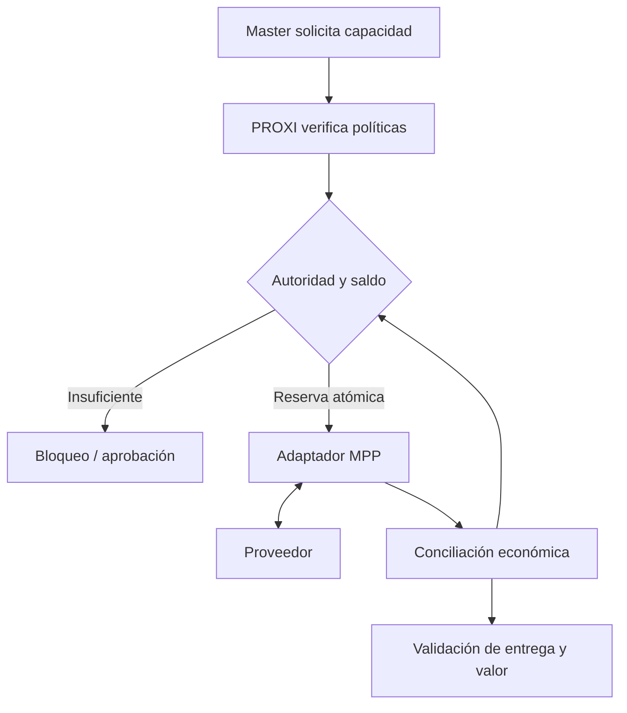

# Economía agéntica, PROXI y MPP

Estado: propuesta documental; sin implementación de pagos. Fecha: 2026-10-08.

## Tesis
Economía agéntica define cómo asignar recursos, controlar compromisos, pagar y medir valor.
PROXI aplica la autoridad económica en runtime. MPP permite intercambiar pagos con servicios compatibles.

## Base existente
ATLAS ya documenta Gobierno de Agentes + AgentOps en [SPEC-059](../specs/17-reusable-agent-governance-agentops.md).
Su separación Control Plane / Observability Plane y su semántica billed / attributed /
unattributed se preservan. Esta propuesta no modifica contratos V1, DDL, APIs ni dashboards.

## MPP
Machine Payments Protocol es un protocolo abierto de pagos entre máquinas desarrollado por Tempo y Stripe.
El servidor presenta condiciones de pago; el cliente las cumple mediante un método y presenta
una credencial para acceder al recurso. El núcleo usa HTTP 402 y un esquema Payment; existe
un perfil de transporte JSON-RPC/MCP. El núcleo sigue siendo un borrador, no un RFC aprobado.

La documentación del proyecto y el enlace histórico al Datatracker pueden reflejar revisiones
distintas: registrar la versión concreta elegida, su estado y SDK antes de implementar.
El soporte de cada método e intención debe verificarse; no asumir compatibilidad universal.

## Gobierno de arquitectura
| Responsabilidad | Dueño lógico |
|---|---|
| Objetivo y coordinación de negocio | Master |
| Autoridad, límites y proveedores | Gobierno + responsable presupuestal |
| Routing y enforcement | PROXI |
| Intercambio del pago | Adaptador MPP |
| Reservas y estados financieros | Ledger transaccional |
| Calidad y costo por resultado | AgentOps + responsable del caso |

Un presupuesto no equivale a una wallet; un pago no equivale a un resultado aceptado.
La autorización para comprar datos no autoriza cualquier tratamiento de esos datos.

## Flujo propuesto

## Controles
- Límites por transacción, tarea, agente, tenant y periodo, con presupuesto padre compartido.
- Reservas atómicas y protección ante concurrencia; impedir bypass del gateway.
- Verificar importe, beneficiario, moneda, vigencia y recurso; no confiar en texto descriptivo.
- Separar al solicitante del aprobador; credenciales fuera del LLM.
- Mantener compromisos inciertos hasta conciliación; controlar reintentos y duplicados.
- Diferenciar pago, liquidación, entrega, aceptación, devolución y disputa.
- Revalidar top-ups y renovaciones; detener un agente no cancela automáticamente compromisos.
- Registrar referencias y metadata redactada, sin exponer credenciales o recibos sensibles.

## Extensión propuesta de AgentOps
Añadir en una versión futura eventos de intención, autorización, reserva, envío, resultado
incierto, conciliación y liberación. Correlacionar con agent_system_id, agent_id, run_id y trace_id.
Agregar parent/task, policy_version, currency, payment_reference y responsable.
No usar BigQuery como autorizador transaccional de gasto. Seleccionar almacenamiento con
garantías de concurrencia y durabilidad mediante un ADR antes de implementar.
No sumar estimado, reservado, pagado y billed como costos independientes; reconciliar
pagos externos con billing para evitar duplicaciones.

## Criterios de aceptación propuestos
- Dos compras de USD 6 con USD 10 disponibles autorizan como máximo una.
- Delegación no incrementa el presupuesto del padre.
- Una aprobación no cubre cambios de precio o destinatario.
- Un timeout no dispara automáticamente un segundo pago.
- Un resultado incorrecto sigue registrándose como pagado si no existe devolución.
- Revocación bloquea nuevas compras y contempla compromisos pendientes.

## Implementación progresiva
FAST DEMO: pagos simulados y datos sintéticos.
MVP: sandbox con reservas, autoridad delegada y reconciliación.
PRODUCT: evidencia de seguridad, revocación, auditoría y operación antes de habilitar fondos reales.

## Fuentes y trazabilidad
Revisadas 2026-10-08:
- https://paymentauth.org/
- https://github.com/tempoxyz/mpp-specs
- https://developers.cloudflare.com/agents/tools/payments/mpp/
- https://datatracker.ietf.org/doc/draft-ryan-httpauth-payment/

La ubicación en PROXI y el modelo presupuestal son propuestas nuestras, no requisitos de MPP.
Detalle técnico: [Governed Agent Payments en DevPattern](https://github.com/JuliusCordova/DevPattern/blob/main/patterns/pattern-packs/governed-agent-payments.md).
Volver al [hub de Gobierno de IA](README.md).
