# ATLAS DataGob — Google Cloud End-to-End Reference Architecture

## 1. Purpose

This document defines the canonical end-to-end data, ML and GenAI architecture that ATLAS DataGob must use as the reference model when evaluating new data initiatives.

The architecture is designed by the Data Architect and must be treated as the baseline. The intake agent must validate each demand against this predefined component model before recommending execution, backlog, reformulation or human architecture review.

## 2. Core principle

ATLAS DataGob must not approve isolated pipelines, isolated dashboards, isolated ML models or isolated agents.

Every initiative must fit into a governed end-to-end architecture from extraction to consumption:

`Sources -> Extraction -> Landing -> Bronze -> Silver -> Gold -> Feature / Knowledge -> Serving -> Consumption -> Monitoring -> FinOps`

If the requested solution introduces a new component, bypasses a mandatory layer, uses a non-approved serving pattern, or cannot be mapped to a known architecture pattern, the agent must request review by a human Data Architect.

## 3. Canonical architecture flow

```mermaid
flowchart LR
    subgraph S[Data Sources]
        S1[ERP / CRM / POS]
        S2[Databases]
        S3[Files / Documents]
        S4[APIs]
        S5[Events / IoT / Logs]
    end

    subgraph I[Extraction and Ingestion]
        I1[Batch ingestion]
        I2[CDC ingestion]
        I3[Streaming ingestion]
        I4[Document ingestion]
    end

    subgraph L[Landing and Bronze]
        L1[Cloud Storage Raw Zone]
        L2[BigLake / External Tables]
        L3[Bronze Dataset]
        L4[Ingestion Control Tables]
    end

    subgraph SI[Silver]
        SI1[Standardization]
        SI2[Data Quality]
        SI3[Deduplication]
        SI4[Conformance]
        SI5[Reconciliation Controls]
    end

    subgraph G[Gold]
        G1[Curated Data Marts]
        G2[Facts and Dimensions]
        G3[Certified Metrics]
        G4[Aggregate Tables]
    end

    subgraph AI[Advanced Data Products]
        AI1[Feature Layer]
        AI2[Knowledge Layer]
        AI3[Vector Index]
        AI4[Prompt / Retrieval Context]
    end

    subgraph C[Serving and Consumption]
        C1[Semantic Model]
        C2[BI Dashboards]
        C3[ML Training]
        C4[ML Batch / Online Serving]
        C5[GenAI / RAG / Agents]
        C6[APIs / Apps]
    end

    subgraph GOV[Governance, Security, Observability and FinOps]
        GOV1[Catalog and Lineage]
        GOV2[Access Control]
        GOV3[Policy Validation]
        GOV4[Monitoring]
        GOV5[Cost Allocation]
        GOV6[Budget and Optimization]
    end

    S --> I --> L --> SI --> G --> AI --> C
    GOV -. governs .- I
    GOV -. governs .- L
    GOV -. governs .- SI
    GOV -. governs .- G
    GOV -. governs .- AI
    GOV -. governs .- C
```



## 4. Google Cloud component map

| Layer | Preferred Google Cloud components | Purpose | Mandatory controls |
|---|---|---|---|
| Sources | ERP, CRM, operational DBs, APIs, files, documents, event streams | Capture data from enterprise sources | Source owner, source SLA, data contract, extraction method |
| Extraction | Datastream, Dataflow, Cloud Run jobs, Cloud Composer or Workflows, Storage Transfer Service, Pub/Sub | Batch, CDC, streaming and document ingestion | Retry, audit log, ingestion metadata, source count |
| Landing / Bronze | Cloud Storage, BigLake external tables, BigQuery external datasets | Preserve raw, immutable and auditable data | Partitioning, retention, lineage, schema capture, raw checksum |
| Silver | BigQuery native tables, Dataform, Dataflow, Dataproc when Spark is required | Clean, type, standardize, deduplicate and integrate | Data quality rules, rejects, lineage, reconciliation, PII tagging |
| Gold | BigQuery curated datasets, data marts, aggregate tables | Business-ready data for analytics and reporting | Facts, dimensions, certified KPIs, metric ownership |
| Semantic | Looker semantic model or Power BI semantic model over certified datasets | Provide governed self-service consumption | Certified metrics, access by role, ownership, versioning |
| Feature Layer | Vertex AI Feature Store or BigQuery-managed feature tables | Reusable ML features | Feature owner, freshness, training-serving consistency |
| ML | Vertex AI Workbench, BigQuery ML, Vertex AI Pipelines, Model Registry, Endpoints, Batch Prediction, Model Monitoring | Train, register, deploy and monitor models | Experiment tracking, approval gate, monitoring, drift checks |
| Knowledge Layer | Cloud Storage documents, BigQuery, Dataplex metadata, embedding generation, BigQuery vector search or Vertex AI Vector Search | Ground GenAI and RAG use cases | Source traceability, chunk metadata, retrieval policy, refresh cadence |
| GenAI / Agents | Gemini, Vertex AI, Gemini ADK, Cloud Run, tool connectors | Enable RAG, agentic workflows and intelligent apps | Prompt policy, grounding evidence, human approval for actions |
| Serving | Cloud Run, API Gateway or Apigee, Looker, Power BI, Looker Studio, Pub/Sub | Deliver data products to users, apps and agents | SLA, auth, audit, operational owner |
| Governance | Dataplex Universal Catalog, IAM, Sensitive Data Protection, Cloud KMS, Secret Manager, Cloud Logging, Cloud Monitoring | Govern data, metadata, access and operations | Catalog registration, lineage, policies, alerts, audit logs |
| FinOps | Cloud Billing export to BigQuery, budgets, labels, Monitoring, BigQuery reservations or on-demand controls | Allocate, control and optimize cloud spend | Labels, budgets, query cost controls, lifecycle policies |

## 5. Approved architecture patterns

### Pattern A — BI / Reporting data product

`Sources -> Batch or CDC -> Cloud Storage / Bronze -> BigQuery Silver -> BigQuery Gold -> Semantic Model -> Dashboard`

Mandatory conditions:

- Gold dataset must expose facts and dimensions or a justified aggregate model.
- Certified KPIs must have a business owner.
- A semantic model is mandatory for reusable executive or self-service dashboards.
- Aggregates must be evaluated when data volume, concurrency or dashboard cost is high.

### Pattern B — Data engineering product

`Sources -> Ingestion -> Bronze -> Silver -> Gold -> Data Product API / Dataset / Dashboard`

Mandatory conditions:

- Source-to-target mapping must exist.
- Reconciliation controls must exist from ingestion to Gold.
- Error and reject handling must be defined.
- Dataset ownership and stewardship must be assigned.

### Pattern C — Machine Learning data product

`Sources -> Bronze -> Silver -> Gold -> Feature Layer -> Training -> Model Registry -> Batch or Online Serving -> Monitoring`

Mandatory conditions:

- Features must be reusable or justified as model-specific.
- Training data must be traceable to Gold or curated Silver.
- Model output must be stored or served through an approved serving pattern.
- Monitoring must include quality, drift, performance and cost.

### Pattern D — GenAI / RAG / Agentic data product

`Sources / Documents -> Bronze -> Silver or Curated Documents -> Knowledge Layer -> Vector Index -> RAG / Agent -> Serving -> Feedback`

Mandatory conditions:

- Knowledge sources must be cataloged and traceable.
- Chunking, embeddings and refresh cadence must be defined.
- RAG responses must include evidence or source references.
- Agentic actions must require human approval when they affect business processes, data access, financial decisions, customers, risk or production systems.

### Pattern E — Streaming / real-time data product

`Events -> Pub/Sub -> Dataflow Streaming -> Bronze/Silver -> BigQuery or Operational Serving -> Alerts / Dashboard / Model`

Mandatory conditions:

- Latency requirement must be explicit.
- Exactly-once or idempotency strategy must be defined.
- Backfill strategy must exist.
- Cost risk must be reviewed before approval.

## 6. Mandatory policy gates

Every initiative must pass the following gates before committee recommendation.

### Gate 1 — Architecture fit

The agent must answer:

- Which approved pattern does this initiative follow?
- Which canonical components are required?
- Which layers are mandatory and which are not applicable?
- Is any new component being introduced?

If no approved pattern applies, mark as `human_architecture_review_required`.

### Gate 2 — Data lifecycle completeness

The agent must validate:

- Extraction method.
- Bronze landing and retention.
- Silver quality and standardization.
- Gold business-ready model when consumption is analytical.
- Feature or Knowledge layer when the target is ML or GenAI.
- Serving pattern.
- Observability and support model.

### Gate 3 — Reconciliation and control

The agent must validate:

- Source record count or control total.
- Bronze ingestion count.
- Silver accepted and rejected records.
- Gold aggregate reconciliation.
- Business metric reconciliation for certified KPIs.
- Exception handling and rerun strategy.

### Gate 4 — Semantic and dataset certification

For BI, executive dashboards, recurring analytics or self-service consumption:

- A semantic model is mandatory.
- Certified datasets must be defined.
- KPI ownership must be assigned.
- Reusable dimensions and metrics must be preferred over report-specific calculations.

### Gate 5 — FinOps readiness

The agent must validate:

- Cost owner and cost center.
- Domain, product, environment and initiative labels.
- Estimated data volume and query frequency.
- BigQuery partitioning and clustering.
- Storage lifecycle policies.
- Serving cost assumptions for APIs, ML endpoints or agents.
- Budget and alert requirement.

### Gate 6 — Human architecture review

The agent must request human review when:

- A component is not in the approved catalog.
- A new pattern is proposed.
- A mandatory layer is skipped without justification.
- A GenAI or agentic use case performs actions beyond recommendation.
- The request includes sensitive data, high-volume streaming, critical decisions or production-impacting automation.
- Cost risk is high or unknown.

## 7. Architecture Compliance Agent

The Sprint 04 intake must include an Architecture Compliance Agent.

### Responsibility

Validate that each demand fits the predefined architecture designed by the Data Architect.

### Inputs

- User requirement.
- Initiative classification.
- Domain and subdomain.
- Data sources.
- Target consumers.
- Expected latency.
- Consumption type: BI, API, ML, GenAI, agentic workflow.
- Policy RAG results.
- Approved architecture catalog.

### Outputs

```json
{
  "architecture_pattern": "bi_reporting | data_engineering | machine_learning | genai_rag | streaming | unknown",
  "is_compliant": true,
  "confidence": 0.0,
  "required_components": [],
  "missing_components": [],
  "policy_gaps": [],
  "finops_gaps": [],
  "human_architecture_review_required": false,
  "recommended_next_action": "approve_for_scoring | request_more_info | reformulate | architect_review",
  "rationale": ""
}
```

## 8. Allowed decision logic

| Condition | Agent decision |
|---|---|
| Fits approved pattern and mandatory controls are complete | Continue to scoring |
| Fits approved pattern but has missing details | Request more information |
| Fits approved pattern but misses mandatory architecture controls | Reformulate |
| Requires new component or new pattern | Route to Data Architect |
| Agentic use case executes actions without approval controls | Route to Data Architect |
| Cost risk is unclear or high | Route to FinOps / Data Architect review |

## 9. FinOps-by-design rules

Every architecture recommendation must include FinOps guidance:

- Prefer serverless and managed services for MVP unless workload justifies dedicated infrastructure.
- Prefer BigQuery datasets and Cloud Storage for low-cost governed analytics MVPs.
- Use partitioning, clustering and aggregate tables to reduce repeated scan cost.
- Register budgets and alerts before production.
- Require labels: `domain`, `data_product`, `environment`, `owner`, `cost_center`, `initiative_id`.
- Avoid always-on serving endpoints unless justified by latency or business value.
- Prefer batch prediction when online prediction is not required.
- Prefer BigQuery vector search for low-cost MVP RAG where scale and latency allow; evaluate Vertex AI Vector Search for high-volume or low-latency RAG.
- Capture billing export to BigQuery for product-level cost attribution.

## 10. Data Architect approval model

The architecture catalog is owned by the Data Architect.

ATLAS DataGob agents can recommend, validate, detect gaps and route decisions, but they cannot approve a new architecture pattern autonomously.

A Data Architect must approve:

- New architecture patterns.
- New major components.
- Exceptions to lifecycle policy.
- Exceptions to reconciliation policy.
- Exceptions to semantic model policy.
- High-risk GenAI or agentic automation.
- High-cost or unclear-cost designs.

## 11. Sprint 04 implementation implication

The Sprint 04 implementation must add:

- Architecture catalog as Markdown/JSON.
- Approved component catalog.
- Approved pattern catalog.
- Architecture Compliance Agent.
- Endpoint for policy and architecture validation.
- Human review routing flag.
- Tests for compliant, incomplete and non-canonical scenarios.

## 12. Design principle

The architecture is not generated from scratch by the model.

The model validates each initiative against an architecture predefined by a Data Architect. If the initiative does not fit, the model escalates instead of inventing a new architecture.
