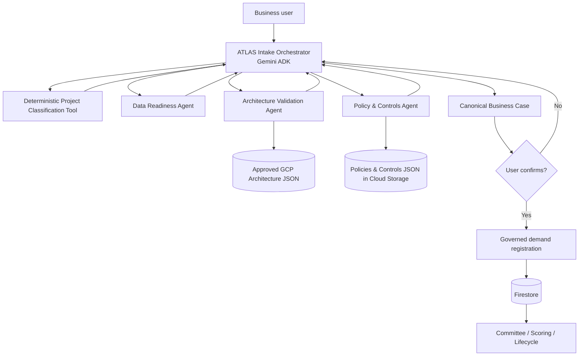

# Feature 54 — Conversational Governed Intake with Gemini ADK

## Objective
Evolve ATLAS DataGob Intake from a deterministic form-oriented flow into a guided business conversation implemented with Gemini Agent Development Kit (ADK), while preserving deterministic governance, architecture, scoring, lifecycle, authorization and persistence controls.

The conversation is not the formal requirement. The confirmed **Business Case / Use Case** is the canonical artifact that initiates the governed demand-registration flow.

## Product principle
- Gemini interprets, asks, structures and explains.
- Specialist agents evaluate when their expertise is required.
- Deterministic services remain the source of truth for rules, gates and calculations.
- A demand is not created until the user confirms the canonical business case.

## ADK topology



## Agents

### 1. ATLAS Intake Orchestrator
Visible conversational agent. Responsibilities:
- Understand the business problem and desired outcome.
- Ask one or two relevant questions at a time.
- Maintain a concise conversational context.
- Determine when specialist evaluation is required.
- Consolidate specialist findings in business language.
- Build the canonical Business Case.
- Never bypass deterministic gates.
- Never register the requirement without explicit user confirmation.

### 2. Data Readiness Agent
Evaluates whether the data required by the business objective is realistically available.

Checks:
- Identified sources.
- Data owner / steward.
- Historical depth when required.
- Known quality.
- Granularity.
- Frequency / latency.
- Sensitive or regulated data.
- Access and integration dependencies.

Output: readiness score, status, gaps and questions.

### 3. Architecture Validation Agent
Validates the requirement against the previously approved end-to-end Google Cloud data lifecycle architecture.

The agent interprets the request, but the compliance result comes from deterministic architecture validation and approved architecture JSON.

Expected lifecycle coverage:
- Sources.
- Extraction / ingestion.
- Landing / raw.
- Bronze.
- Silver.
- Gold.
- Quality and reconciliation when applicable.
- Serving: BI, API, ML, RAG or agent.
- Monitoring / observability.
- Lineage / governance.
- Security.
- FinOps.

Output: approved pattern, detected components, missing components, gaps, exceptions and human review requirement.

### 4. Policy & Controls Agent
Retrieves applicable policies from Cloud Storage JSON and explains them to the user.

The agent must not invent policy requirements. Applicable controls are returned by deterministic policy filtering over versioned JSON records.

Output: applicable policies, mandatory controls, gaps, recommended controls and evidence references.

## Initiative taxonomy
The conversational classifier uses a business-facing taxonomy:
- `data_engineering`
- `dashboard_analytics`
- `machine_learning`
- `generative_ai`
- `agentic_ai`
- `data_governance`
- `hybrid`
- `unknown`

### Agentic AI subtypes
When the primary or secondary type is `agentic_ai`, ATLAS classifies the agent capability as one of:
- `knowledge_agent`
- `recommendation_agent`
- `workflow_agent`
- `action_agent`
- `multi_agent_system`

The subtype must reflect the autonomy requested by the business, not marketing terminology.

## Canonical Business Case
Minimum canonical artifact:

```json
{
  "business_problem": "",
  "desired_outcome": "",
  "business_area": "",
  "stakeholders": [],
  "impacted_process": "",
  "current_situation": "",
  "success_metrics": [],
  "data_sources": [],
  "project_classification": {
    "primary_type": "",
    "subtype": "",
    "agent_type": null,
    "secondary_capabilities": [],
    "confidence": 0.0,
    "signals": []
  },
  "data_readiness": {},
  "architecture_assessment": {},
  "policy_assessment": {},
  "preliminary_risk": "",
  "gaps": [],
  "recommendation": "",
  "completeness": 0,
  "ready_to_register": false
}
```

## Definition of Ready
Before ATLAS offers **Confirm and register**, the following must be sufficiently defined:
- Business problem.
- Expected outcome.
- Business area / stakeholders.
- Impacted process.
- Success measure.
- Known data sources or explicit statement that they are unknown.
- Project classification.
- Data-readiness assessment.
- Architecture assessment when the project affects the data lifecycle or serving architecture.
- Applicable policy assessment.
- Identified gaps and next action.

## Governance catalog in Cloud Storage
Production source:

```text
gs://<ATLAS_GOVERNANCE_BUCKET>/<ATLAS_GOVERNANCE_PREFIX>/
  policies/
    data/
    ml/
    genai/
    agentic/
    privacy/
    security/
    finops/
  architecture_patterns/
    data_engineering.json
    dashboard_analytics.json
    machine_learning.json
    generative_ai.json
    agentic_ai.json
```

JSON records are versioned and include at minimum `id`, `version`, `status`, applicability and controls/components.

Local JSON under `data/governance/` is allowed only as development/test fallback. Production uses Cloud Storage when `ATLAS_GOVERNANCE_BUCKET` is configured.

## Functional requirements
- FR54-01: Start or resume a conversational intake session.
- FR54-02: Orchestrator asks guided business questions rather than exposing technical forms as the primary experience.
- FR54-03: Classify project type and subtype from conversational context.
- FR54-04: Classify agent type when Agentic AI applies.
- FR54-05: Invoke Data Readiness Agent when data feasibility needs evaluation.
- FR54-06: Invoke Architecture Validation Agent when architecture/lifecycle validation is relevant.
- FR54-07: Invoke Policy & Controls Agent before the Business Case is ready to register.
- FR54-08: Retrieve production policies and architecture JSON from Cloud Storage.
- FR54-09: Produce a canonical Business Case.
- FR54-10: Require explicit confirmation before creating the demand.
- FR54-11: Persist the confirmed demand through the existing governed repository/lifecycle.
- FR54-12: Preserve existing deterministic scoring, authorization and committee gates.

## Non-functional requirements
- NFR54-01: Gemini ADK is the required orchestration framework.
- NFR54-02: Vertex AI is the Gemini runtime in GCP.
- NFR54-03: Policy and architecture evaluation must be traceable to catalog IDs/versions.
- NFR54-04: LLM responses cannot directly mutate Firestore without a governed tool/action.
- NFR54-05: Existing deterministic APIs remain backward compatible.
- NFR54-06: No policy or architecture control may be invented by the LLM.
- NFR54-07: Specialist-agent outputs must be structured JSON-compatible objects.
- NFR54-08: Production Cloud Run identity receives read-only access to the governance bucket.

## Acceptance criteria
- AC54-01: `root_agent` is a real Gemini ADK agent with three specialist sub-agents.
- AC54-02: A business user can describe a need without choosing a project type first.
- AC54-03: ATLAS distinguishes Data Engineering, Dashboard/Analytics, ML, GenAI and Agentic AI.
- AC54-04: Agentic initiatives return an agent subtype.
- AC54-05: Architecture evaluation references an approved GCP architecture pattern.
- AC54-06: Policy evaluation returns IDs/versions loaded from JSON catalog.
- AC54-07: The agent can identify missing information and continue the conversation instead of prematurely registering the demand.
- AC54-08: A canonical Business Case is generated before registration.
- AC54-09: Demand creation requires explicit confirmation.
- AC54-10: Existing demand backlog, scoring and committee tests remain green.

## Deferred
- Persistent ADK session service across Cloud Run replicas.
- Long-term conversational memory.
- Vector search over policies.
- Autonomous remediation of policy/architecture gaps.
- Autonomous committee decisions.
