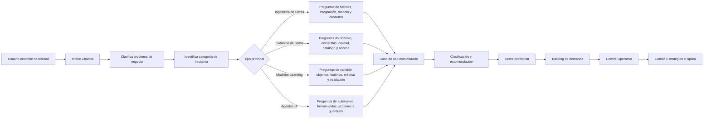

# 08 · Intake Classification Agent

## Decisión aprobada

El producto **ATLAS DataGob** debe incluir un **chatbot de intake** para ayudar a usuarios de negocio, Data Owners y Domain Owners a estructurar sus casos de uso antes de que entren al portafolio.

El chatbot no solo captura una solicitud. También debe **clasificar el tipo de iniciativa** para enrutarla correctamente, definir el nivel de evaluación requerido y preparar la información mínima para comités.

## Clasificación principal de iniciativas

Toda demanda debe clasificarse en una o más de las siguientes categorías:

| Categoría | Descripción | Ejemplos | Validaciones clave |
|---|---|---|---|
| Ingeniería de Datos | Iniciativas orientadas a ingesta, integración, transformación, modelado, publicación o explotación de datos. | Pipeline, integración de fuente, capa silver/gold, modelo analítico, API de datos, dashboard alimentado por datasets. | Fuentes, frecuencia, volumen, modelo destino, SLAs, ownership, esfuerzo técnico. |
| Gobierno de Datos | Iniciativas orientadas a ownership, calidad, catálogo, linaje, políticas, privacidad, acceso o stewardship. | Alta de dominio, reglas de calidad, catálogo, glosario, linaje, matriz de acceso, clasificación de datos. | Dominio, Data Owner, Data Steward, criticidad, sensibilidad, políticas, controles. |
| Machine Learning | Iniciativas orientadas a predicción, clasificación, recomendación, optimización o analítica avanzada. | Predicción de demanda, churn, scoring, forecast, recomendador, detección de anomalías. | Variable objetivo, datos históricos, métrica de éxito, baseline, explicabilidad, MLOps, sesgos. |
| Agentes IA | Iniciativas orientadas a asistentes, copilotos o agentes con razonamiento, herramientas, acciones o interacción multietapa. | Agente de intake, agente de soporte, agente de análisis, agente de validación, agente autónomo con herramientas. | Autonomía, herramientas, acciones permitidas, human-in-the-loop, guardrails, auditoría, riesgo. |

## Clasificación secundaria

Además de la categoría principal, el chatbot debe identificar:

- Dominio de datos.
- Subdominio.
- Área solicitante.
- Sponsor de negocio.
- Data Owner sugerido.
- Data Steward sugerido.
- Tipo de valor esperado.
- Nivel de urgencia.
- Nivel de riesgo.
- Nivel de complejidad.
- Necesidad de PoC.
- Necesidad de comité operativo.
- Necesidad de comité estratégico.

## Reglas de enrutamiento

| Condición | Ruta sugerida |
|---|---|
| Solicitud incompleta o sin sponsor | Solicitar más información antes de priorizar. |
| Ingeniería de datos simple y datos disponibles | Triage operativo + scoring. |
| Gobierno de datos con impacto transversal | Comité Operativo + posible Comité Estratégico. |
| Machine Learning con datos históricos y variable objetivo clara | Evaluación de viabilidad ML + posible PoC. |
| Machine Learning sin datos históricos suficientes | Reformular o backlog de preparación de datos. |
| Agente IA con acciones sobre sistemas o alta autonomía | Revisión especializada de riesgo, seguridad y human-in-the-loop. |
| Iniciativa con datos sensibles o impacto regulatorio | Validación de seguridad, legal, privacidad y gobierno. |
| Iniciativa con inversión significativa o impacto transversal | Escalamiento a Comité Estratégico. |

## Flujo conversacional del chatbot



## Preguntas base del chatbot

### Preguntas comunes

1. ¿Qué problema de negocio quieres resolver?
2. ¿Qué decisión, proceso o resultado quieres mejorar?
3. ¿Quién es el sponsor de negocio?
4. ¿Qué áreas participan o se verán impactadas?
5. ¿Qué datos crees que se necesitan?
6. ¿Qué beneficio esperas obtener?
7. ¿Cómo sabríamos que la iniciativa fue exitosa?
8. ¿Existe una fecha objetivo o urgencia específica?

### Preguntas para Ingeniería de Datos

- ¿Qué fuentes de datos se requieren?
- ¿Los datos ya existen o deben integrarse desde una nueva fuente?
- ¿La necesidad es batch, near real-time o real-time?
- ¿Se requiere capa raw, silver, gold o semántica?
- ¿Quién consumirá el dataset o producto de datos?
- ¿Existen reglas de calidad, reconciliación o validación?

### Preguntas para Gobierno de Datos

- ¿A qué dominio o subdominio pertenece la información?
- ¿Existe Data Owner definido?
- ¿Existe Data Steward definido?
- ¿Qué reglas de calidad son necesarias?
- ¿El dato debe catalogarse, clasificarse o publicar linaje?
- ¿Hay información sensible o restricciones de acceso?

### Preguntas para Machine Learning

- ¿Qué se quiere predecir, clasificar, optimizar o recomendar?
- ¿Existe variable objetivo definida?
- ¿Hay datos históricos suficientes?
- ¿Cuál sería la métrica de éxito del modelo?
- ¿Existe un proceso actual contra el cual comparar el modelo?
- ¿El resultado del modelo impacta decisiones críticas o personas?

### Preguntas para Agentes IA

- ¿Qué tarea debe asistir o ejecutar el agente?
- ¿El agente solo recomienda o también realiza acciones?
- ¿Qué herramientas, sistemas o fuentes debe consultar?
- ¿Qué decisiones requieren aprobación humana?
- ¿Qué riesgos existen si el agente se equivoca?
- ¿Qué trazabilidad, auditoría y límites de autonomía se requieren?

## Salida esperada del chatbot

El chatbot debe producir una ficha estructurada de iniciativa:

```json
{
  "title": "string",
  "business_problem": "string",
  "initiative_category": "data_engineering | data_governance | machine_learning | agentic_ai | hybrid",
  "secondary_categories": [],
  "domain": "string",
  "subdomain": "string",
  "sponsor": "string",
  "expected_value": "string",
  "success_metric": "string",
  "data_sources": [],
  "risks": [],
  "missing_information": [],
  "recommended_route": "triage | committee_operational | committee_strategic | poc | reformulate",
  "needs_poc": true,
  "human_decision_required": true
}
```

## Criterios de aceptación

- El chatbot debe poder recibir texto libre de un usuario de negocio.
- Debe identificar si la iniciativa es de ingeniería de datos, gobierno de datos, machine learning, agentes IA o híbrida.
- Debe realizar preguntas de clarificación según la categoría detectada.
- Debe generar una ficha estructurada de iniciativa.
- Debe sugerir ruta de evaluación, pero no tomar decisión final.
- Debe registrar información faltante.
- Debe permitir que el usuario corrija la clasificación sugerida.
- Debe guardar trazabilidad de preguntas, respuestas, clasificación y cambios.
- Debe alimentar el backlog de demanda y el scoring preliminar.
- Debe escalar a revisión humana cuando existan datos sensibles, alta autonomía, impacto transversal o alto riesgo.

## Principio de diseño

El chatbot de intake debe ayudar a negocio a pensar mejor su caso de uso, no solo llenar un formulario.

Su propósito es convertir una idea ambigua en una iniciativa clara, clasificada, gobernable y lista para evaluación.