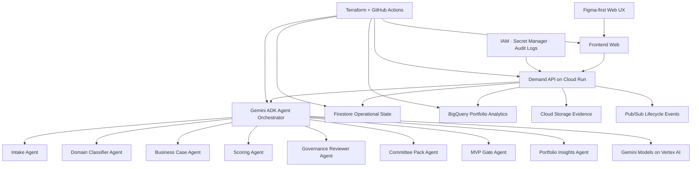
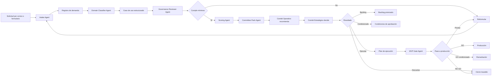
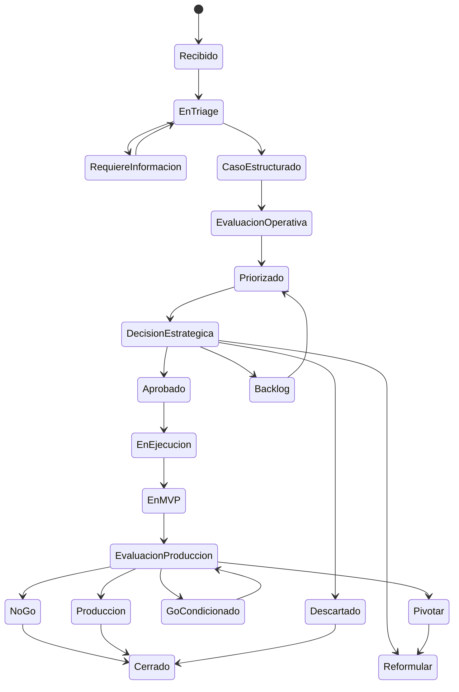

# 09 · Arquitectura MVP agéntica

## Decisión

ATLAS DataGob será desarrollado como MVP agéntico en Google Cloud usando **Gemini ADK** para la capa de agentes.

El producto mantiene separación clara frente a DataOps: gobierna demanda, priorización, decisiones y gates; no ejecuta pipelines productivos de datos.

## Diagrama Mermaid · Arquitectura

## Componentes

### Frontend Web

Responsable de:

- Dashboard ejecutivo.
- Registro de demanda.
- Triage asistido.
- Scoring.
- Vista de comités.
- MVP Gate.
- Detalle de iniciativa.
- Configuración.

### Demand API

Responsable de:

- CRUD de demandas.
- Estados del ciclo de vida.
- Scoring persistido.
- Decisiones de comité.
- Registro de evidencias.
- Integración con agentes.

### Agent Orchestrator

Servicio construido con Gemini ADK para coordinar agentes especializados.

### Persistencia

- Firestore: estado operacional y documentos del ciclo de vida.
- BigQuery: analítica de portafolio y métricas ejecutivas.
- Cloud Storage: adjuntos, actas, evidencias y exportaciones.
- Pub/Sub: eventos desacoplados.

## Flujo Mermaid · Gestión de demanda

## Estados del ciclo de vida

