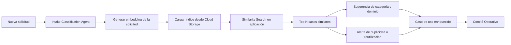
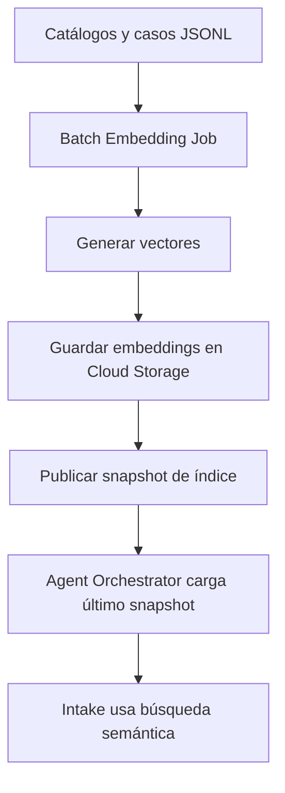

# 09 · Validación RAG contra proyectos existentes y dominios sintéticos

## Decisión aprobada

ATLAS DataGob incorporará una capacidad de validación semántica contra proyectos existentes y dominios de datos de referencia, con el objetivo de ayudar al chatbot de intake a detectar similitudes, duplicidades, casos relacionados, dominios probables y patrones reutilizables antes de enviar una iniciativa a evaluación.

Esta capacidad debe implementarse con un patrón de bajo costo para MVP, usando Cloud Storage como repositorio de conocimiento y un índice vectorial liviano generado a partir de datos sintéticos y casos históricos demostrativos.

## Objetivo

Permitir que el Intake Classification Agent compare una solicitud nueva contra una base de conocimiento de iniciativas, dominios, subdominios, casos de uso, proyectos previos y decisiones de comité, para enriquecer la clasificación y reducir duplicidades.

## Principio clave

Cloud Storage no se tratará como una base de datos vectorial nativa, sino como un repositorio económico de artefactos e índices precomputados. Para el MVP, la búsqueda semántica puede ejecutarse en la capa de aplicación usando embeddings almacenados como archivos JSONL o Parquet. En una fase posterior, el índice podrá migrar a BigQuery vector search, Vertex AI Vector Search u otra base vectorial especializada si el volumen o la latencia lo requieren.

## Casos de uso soportados

1. Detectar iniciativas similares ya registradas.
2. Sugerir dominio y subdominio con base en casos previos.
3. Identificar si una demanda parece de ingeniería de datos, gobierno, machine learning, agentes IA o híbrida.
4. Recomendar reutilización de activos existentes.
5. Alertar posibles duplicidades.
6. Enriquecer el business case con patrones comparables.
7. Sugerir preguntas adicionales al usuario de negocio o domain owner.
8. Mostrar antecedentes al Comité Operativo.

## Fuentes iniciales de conocimiento

### 1. Catálogo sintético de dominios

Archivo sugerido:

```text
knowledge/domains/domain_catalog.jsonl
```

Contenido mínimo por registro:

```json
{
  "domain_id": "customer",
  "domain_name": "Clientes y Partes Comerciales",
  "subdomain_name": "Contactabilidad",
  "description": "Datos de correos, teléfonos, direcciones y canales de contacto del cliente.",
  "keywords": ["cliente", "contacto", "teléfono", "email", "dirección"],
  "owner_role": "Data Owner de Clientes",
  "steward_role": "Data Steward de Clientes"
}
```

### 2. Catálogo sintético de proyectos existentes

Archivo sugerido:

```text
knowledge/projects/project_cases.jsonl
```

Contenido mínimo por registro:

```json
{
  "project_id": "DG-REF-001",
  "title": "Normalización de direcciones de clientes",
  "summary": "Iniciativa para mejorar calidad, geocodificación y completitud de direcciones de clientes.",
  "category": "Gobierno de datos",
  "domain": "Clientes y Partes Comerciales",
  "subdomain": "Ubicación Geográfica y Direcciones",
  "business_value": "Mejor segmentación comercial y eficiencia de distribución.",
  "status": "Aprobado",
  "decision": "Ejecutar",
  "tags": ["calidad", "clientes", "direcciones", "georreferencia"]
}
```

### 3. Catálogo de decisiones y aprendizajes

Archivo sugerido:

```text
knowledge/decisions/committee_decisions.jsonl
```

Contenido mínimo:

```json
{
  "decision_id": "DEC-001",
  "project_id": "DG-REF-001",
  "decision": "Ejecutar",
  "rationale": "Alto valor comercial y buena disponibilidad de datos.",
  "conditions": ["Confirmar Data Owner", "Validar calidad de direcciones"],
  "lessons_learned": ["Validar completitud antes de geocodificar"]
}
```

## Arquitectura MVP de bajo costo



## Componentes técnicos

| Componente | Descripción |
|---|---|
| Cloud Storage | Repositorio económico de datos sintéticos, catálogos, casos, decisiones e índices precomputados. |
| Embedding Service | Servicio que genera embeddings de solicitudes, proyectos, dominios y decisiones. |
| Vector Index JSONL/Parquet | Archivo con texto normalizado, metadatos y vector embedding. |
| Similarity Search Runtime | Cálculo de similitud en la aplicación para MVP. Puede ser cosine similarity simple o librería local. |
| Intake Classification Agent | Usa resultados semánticos para clasificar, preguntar y recomendar. |
| Firestore | Guarda la recomendación, justificación y trazabilidad operacional. |
| BigQuery | Consolida métricas de portafolio y uso de recomendaciones. |

## Estructura sugerida en Cloud Storage

```text
gs://atlas-datagob-knowledge-{env}/
  domains/
    domain_catalog.jsonl
  projects/
    project_cases.jsonl
  decisions/
    committee_decisions.jsonl
  embeddings/
    domain_embeddings.jsonl
    project_embeddings.jsonl
    decision_embeddings.jsonl
  snapshots/
    index_snapshot_YYYYMMDD.jsonl
```

## Flujo de actualización del índice



## Resultado esperado del agente

El agente debe devolver una salida estructurada:

```json
{
  "suggested_category": "Gobierno de datos",
  "suggested_domain": "Clientes y Partes Comerciales",
  "suggested_subdomain": "Ubicación Geográfica y Direcciones",
  "confidence": 0.84,
  "similar_cases": [
    {
      "project_id": "DG-REF-001",
      "title": "Normalización de direcciones de clientes",
      "similarity": 0.91,
      "relevance_reason": "Comparte dominio, problema de calidad y uso de direcciones."
    }
  ],
  "duplication_risk": "Medio",
  "reuse_opportunities": [
    "Reutilizar reglas de calidad de direcciones",
    "Reutilizar criterios de geocodificación"
  ],
  "questions_to_user": [
    "¿El objetivo es corregir direcciones, geocodificar o segmentar clientes?",
    "¿Existe un Data Owner confirmado para el dominio de Clientes?"
  ]
}
```

## Reglas de diseño

1. El RAG debe apoyar la clasificación, no tomar la decisión final.
2. Toda recomendación debe mostrar casos similares y razón de similitud.
3. El usuario debe poder aceptar, corregir o descartar la recomendación.
4. Las similitudes deben quedar registradas como evidencia de evaluación.
5. La solución debe iniciar con datos sintéticos para evitar exposición de información sensible.
6. Los datos sintéticos deben representar dominios, subdominios, casos y decisiones realistas.
7. El índice debe poder reemplazarse por una solución vectorial administrada sin cambiar el contrato del agente.

## Criterios de aceptación

- Dada una solicitud nueva, el sistema genera embedding o representación semántica.
- El sistema consulta un índice de conocimiento basado en archivos alojados en Cloud Storage.
- El agente retorna al menos tres casos similares cuando existan coincidencias relevantes.
- El agente sugiere categoría de iniciativa: Ingeniería de datos, Gobierno de datos, Machine Learning, Agentes IA o Híbrida.
- El agente sugiere dominio y subdominio con nivel de confianza.
- El agente identifica riesgo de duplicidad: Bajo, Medio o Alto.
- El agente propone oportunidades de reutilización.
- El agente genera preguntas de aclaración para el usuario de negocio o domain owner.
- La recomendación queda guardada con trazabilidad.
- La implementación inicial funciona con datos sintéticos.

## Evolución futura

| Fase | Tecnología sugerida | Cuándo usarla |
|---|---|---|
| MVP | Cloud Storage + JSONL/Parquet + similarity en app | Bajo volumen, demo, bajo costo. |
| Fase 2 | BigQuery + embeddings + vector search | Cuando se requiera analítica y búsqueda sobre mayor volumen. |
| Fase 3 | Vertex AI Vector Search | Cuando se requiera baja latencia, mayor escala y operación administrada. |
| Fase 4 | Integración con catálogo de datos | Cuando existan activos reales, dominios gobernados y linaje. |

## Implicancia en UX

El prototipo Figma debe incluir una sección en la pantalla de Triage Asistido llamada **Casos similares encontrados**, mostrando:

- nombre del caso similar,
- porcentaje de similitud,
- dominio/subdominio,
- decisión histórica,
- recomendación del agente,
- botón para reutilizar patrón,
- botón para marcar como no relacionado.
