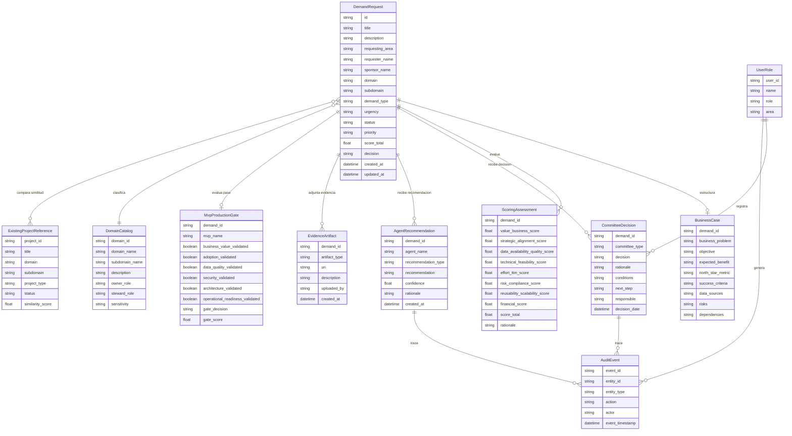

# 10 · Arquitectura canónica de datos

## Decisión aprobada

ATLAS DataGob debe registrar el **diccionario de datos del sistema** y el **diagrama entidad-relación** como parte de la arquitectura canónica del producto antes de iniciar desarrollo.

Estos artefactos no deben tratarse como documentación anexa o posterior. Deben formar parte de la fuente de verdad técnica y funcional del repositorio, junto con las specs, flujos Mermaid, arquitectura MVP, prototipo Figma y criterios de aceptación.

## Propósito

Asegurar que el desarrollo de ATLAS DataGob parta de un entendimiento común sobre:

- Entidades principales del producto.
- Atributos funcionales y técnicos.
- Relaciones entre entidades.
- Estados del ciclo de vida de la demanda.
- Datos obligatorios para intake, scoring, comité y MVP gate.
- Trazabilidad requerida para decisiones humanas y recomendaciones agénticas.
- Preparación para analítica, RAG y validación contra iniciativas existentes.

## Artefactos canónicos requeridos

### 1. Diccionario de datos del sistema

Debe registrar, como mínimo:

- Nombre de entidad.
- Nombre de campo.
- Descripción funcional.
- Tipo de dato lógico.
- Obligatoriedad.
- Dominio de valores permitido.
- Fuente de captura o generación.
- Responsable funcional.
- Uso en pantallas, agentes, scoring o reportes.
- Clasificación de sensibilidad.
- Regla de validación.
- Observaciones de gobierno.

### 2. Diagrama entidad-relación

Debe representar las entidades principales y sus relaciones, incluyendo como mínimo:

- DemandRequest.
- BusinessCase.
- ScoringAssessment.
- CommitteeDecision.
- MvpProductionGate.
- AgentRecommendation.
- EvidenceArtifact.
- DomainCatalog.
- ExistingProjectReference.
- UserRole.
- AuditEvent.

### 3. Catálogo de dominios y subdominios

Debe mantenerse como configuración reusable y no acoplada a una organización específica.

Debe permitir registrar:

- Dominio.
- Subdominio.
- Descripción.
- Data Owner sugerido.
- Data Steward sugerido.
- Sensibilidad esperada.
- Ejemplos de datos.
- Casos de uso frecuentes.
- Relación con iniciativas existentes.

### 4. Catálogo de proyectos existentes

Debe alimentar el RAG liviano de validación y permitir que el chatbot de intake detecte:

- Duplicidades.
- Iniciativas similares.
- Proyectos relacionados.
- Patrones reutilizables.
- Dominios probables.
- Lecciones aprendidas de comité.

## Modelo lógico canónico inicial



## Ubicación sugerida en el repositorio

```text
/docs
  /specs
    10-canonical-data-architecture.md
  /data-dictionary
    data-dictionary.md
    data-dictionary.csv
  /diagrams
    canonical-er-diagram.mmd
    canonical-er-diagram.png
  /samples
    domain-catalog.synthetic.jsonl
    existing-projects.synthetic.jsonl
```

## Relación con RAG liviano

El diccionario de datos, el catálogo de dominios y el catálogo de proyectos existentes deben poder convertirse en documentos de referencia para el RAG liviano definido en `09-rag-project-domain-validation.md`.

Para el MVP, estos activos pueden almacenarse como archivos `JSONL`, `CSV`, `Markdown` o `Parquet` en Cloud Storage. El índice vectorial puede generarse a partir de:

- Nombre y descripción de entidades.
- Campos del diccionario de datos.
- Descripciones de dominios y subdominios.
- Resúmenes de proyectos existentes.
- Decisiones históricas de comité.
- Lecciones aprendidas.

## Workflow de trabajo tipo PrimaDemo

El desarrollo debe operar con un flujo controlado de Git similar a PrimaDemo:

```bash
git checkout main
git pull origin main
git checkout -b sprint/<numero>-<objetivo>
```

Antes de iniciar cualquier tarea técnica, el equipo debe ejecutar:

```bash
git pull origin main
```

o actualizar la rama de trabajo con la última versión aprobada de specs.

## Reglas de trabajo

1. Ningún desarrollo debe iniciar sin revisar las specs vigentes.
2. El diccionario de datos y el diagrama ER deben estar versionados.
3. Los cambios al modelo de datos deben pasar por PR.
4. Toda nueva entidad debe actualizar:
   - diccionario de datos,
   - diagrama ER,
   - contratos API,
   - persistencia,
   - pruebas,
   - impacto en agentes.
5. Las recomendaciones agénticas no modifican la arquitectura canónica sin aprobación humana.
6. El core debe mantenerse reusable y no acoplado a una organización específica.

## Criterios de aceptación

- Existe una spec de arquitectura canónica versionada en Git.
- El diccionario de datos es considerado fuente de verdad del modelo lógico.
- El diagrama ER forma parte del repositorio y puede ser actualizado por PR.
- El RAG de validación puede usar el diccionario y el catálogo de proyectos como fuentes de conocimiento.
- El workflow de desarrollo exige `git pull` antes de iniciar cambios.
- Toda modificación del modelo de datos queda trazada en Git.
- La arquitectura canónica se mantiene alineada con Figma, API, agentes y persistencia.

## Principio clave

**ATLAS DataGob se construye desde specs, modelo canónico y diseño Figma-first; no desde código aislado.**
