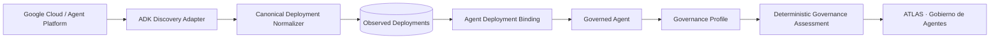
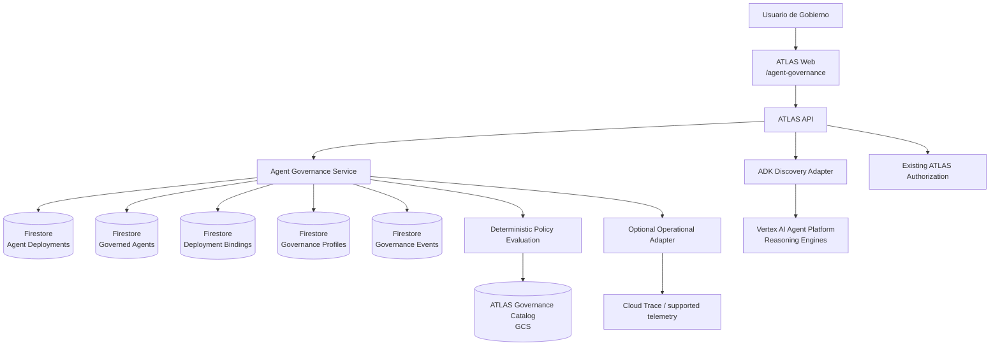

# Feature 56 — Gobierno de Agentes ADK

## 1. Estado del SPEC

- **Producto:** ATLAS DataGob
- **Feature:** 56
- **Nombre funcional:** Gobierno de Agentes
- **Nombre de producto:** ATLAS Agent Governance — ADK Edition
- **Estado:** Baseline funcional aprobado para SDD
- **Alcance V1:** Google ADK / Google Cloud
- **Tipo de cambio:** Nueva pantalla independiente dentro de ATLAS DataGob

## 2. Objetivo

Incorporar en ATLAS DataGob una nueva capacidad dedicada exclusivamente al **gobierno de agentes construidos/desplegados con Google ADK**, reutilizando la estructura visual y los patrones de observabilidad ya validados en el Governance Dashboard de Business Rules Silver, pero orientándolos a un inventario corporativo de agentes.

La capacidad debe permitir responder, desde una sola pantalla, preguntas como:

- ¿Cuántos agentes ADK existen en el entorno observado?
- ¿Cuántos están gobernados y cuántos todavía no han sido evaluados?
- ¿Quién es responsable funcional y técnico de cada agente?
- ¿Cuál es su nivel de riesgo y autonomía?
- ¿Qué modelo/runtime utiliza?
- ¿Qué políticas y controles le aplican?
- ¿Qué hallazgos de gobierno están abiertos?
- ¿Qué evidencia existe sobre su evaluación?
- ¿Qué información operacional está disponible desde la plataforma sin instrumentar individualmente al agente?

## 3. Principio de producto

> **ATLAS gobierna el estate de agentes ADK desde un plano de control externo. No requiere integrar, modificar ni instrumentar de forma específica cada agente gobernado.**

La V1 será **out-of-band**.

ATLAS podrá descubrir y observar información disponible en Google ADK / Agent Platform / Vertex AI y complementarla con metadatos de gobierno administrados por ATLAS.

### 3.1 Decisiones aprobadas

1. La nueva capacidad será una **pantalla adicional** de ATLAS DataGob.
2. La pantalla se denominará inicialmente **Gobierno de Agentes**.
3. El alcance V1 será exclusivamente **Google ADK**.
4. La pantalla utilizará como inventario base los agentes/deployments que puedan descubrirse mediante las capacidades disponibles de Google Agent Platform / Vertex AI / ADK.
5. No se modificará el código de los agentes para poder gobernarlos.
6. No se instalará un SDK ATLAS dentro de cada agente.
7. ATLAS no interceptará llamadas, prompts, tool calls o respuestas en V1.
8. ATLAS no implementará enforcement runtime, kill switch ni bloqueo de tools en V1.
9. El estado de gobierno será una capa complementaria administrada por ATLAS y enlazada al identificador estable del recurso descubierto.
10. La pantalla reutilizará como referencia visual el patrón de dashboard ejecutivo, filtros, tablas y drill-down lateral ya probado en Business Rules Silver.
11. Después del spike real, un `ReasoningEngine` descubierto se modela como **ObservedDeployment**, no como agente lógico gobernado.
12. El KPI `Governed agents` cuenta entidades lógicas `GovernedAgent`; los Reasoning Engines se contabilizan separadamente como deployments observados.

## 4. Posicionamiento dentro de ATLAS

```text
ATLAS DataGob
│
├── Portfolio Governance
│   ├── Intake conversacional
│   ├── Business Cases
│   ├── Comité
│   ├── Scoring
│   └── Backlog / Portafolio
│
└── Agent Governance
    ├── Resumen ejecutivo
    ├── Agentes gobernados
    ├── Deployments ADK observados
    ├── Riesgo
    ├── Ownership
    ├── Autonomía
    ├── Políticas
    ├── Hallazgos
    ├── Salud / actividad disponible
    └── Evidencia
```

Portfolio Governance y Agent Governance pertenecen al mismo producto, pero **no quedan acoplados funcionalmente en V1**. Un agente gobernado no necesita haber nacido de una demanda registrada en ATLAS.

## 5. Alcance funcional V1

### 5.1 Resumen ejecutivo

La pantalla debe mostrar como mínimo:

- deployments ADK observados;
- deployments no asociados a una identidad lógica;
- agentes gobernados;
- agentes no evaluados;
- agentes de alto riesgo;
- hallazgos abiertos;
- agentes con revisión requerida;
- estado operacional agregado cuando la fuente lo permita.

Los KPIs deberán ser clicables y actuar como filtros o abrir el detalle correspondiente.

### 5.2 Inventario ADK

ATLAS debe mantener un inventario normalizado de deployments observados desde Google Cloud y una capa separada de agentes lógicos gobernados.

Campos observados, cuando estén disponibles desde la plataforma:

- `provider_deployment_id`;
- `resource_name`;
- `display_name`;
- `framework`;
- `project_id`;
- `location`;
- `service_account`;
- `deployment_source_kind`;
- `created_at`;
- `updated_at`;
- metadata/tags disponibles;
- source de discovery;
- timestamp de última observación.

ATLAS **no debe inventar** campos que Google no exponga. Los campos no disponibles se muestran como `No disponible` o `No evaluado`.

### 5.3 Perfil de gobierno

ATLAS complementará el agente lógico con un perfil administrado de gobierno.

Campos mínimos:

- Business Owner;
- Technical Owner;
- propósito de negocio;
- área / dominio;
- ambiente declarado;
- criticidad del proceso;
- nivel de autonomía;
- nivel de riesgo;
- clasificación de datos;
- Human-in-the-Loop requerido;
- acceso de escritura a sistemas, si aplica;
- políticas aplicables;
- controles requeridos;
- estado de evaluación;
- fecha de última evaluación;
- próximo review;
- observaciones.

### 5.4 Estado de gobierno

Se separan lifecycle, riesgo y compliance.

#### Deployment discovery status

- `discovered`
- `active`
- `inactive`
- `not_observed`

#### Deployment binding status

- `unbound`
- `bound`
- `binding_review_required`

#### Governance status

- `not_assessed`
- `under_review`
- `governed`
- `action_required`
- `decommissioned`

#### Risk level

- `low`
- `medium`
- `high`
- `critical`
- `not_assessed`

Un deployment nuevo descubierto debe aparecer por defecto como:

```text
Discovery: discovered
Binding: unbound
```

Y un agente lógico nuevo debe iniciar como:

```text
Governance: not_assessed
Risk: not_assessed
```

### 5.5 Evaluación de gobierno

La evaluación de V1 será determinística y basada únicamente en metadatos observados + datos explícitamente mantenidos en el perfil de gobierno.

Dimensiones mínimas:

1. Ownership definido.
2. Propósito de negocio definido.
3. Riesgo evaluado.
4. Autonomía declarada.
5. Human oversight definido.
6. Datos / clasificación declarados.
7. Políticas aplicables identificadas.
8. Controles obligatorios registrados.
9. Evidencia mínima disponible.
10. Review vigente.

La evaluación no deberá usar al LLM como fuente de verdad para decidir cumplimiento.

Gemini puede posteriormente explicar hallazgos, pero la condición `governed` debe derivarse de reglas determinísticas.

### 5.6 Políticas

La feature debe reutilizar el catálogo de políticas gobernadas de ATLAS.

Cuando corresponda, se incluirá `AGENT-001` y cualquier política adicional de agentes que se agregue formalmente al catálogo versionado.

Reglas:

- ninguna política puede ser inventada por Gemini;
- toda política mostrada debe incluir `id` y `version`;
- los hallazgos deben referenciar la política/control que los origina;
- cambios de versión de política deben ser trazables.

### 5.7 Hallazgos

Modelo mínimo de finding:

```json
{
  "finding_id": "AGF-...",
  "agent_id": "...",
  "policy_id": "AGENT-001",
  "policy_version": "1.0",
  "severity": "medium",
  "status": "open",
  "title": "Human oversight no definido",
  "description": "...",
  "detected_at": "...",
  "resolved_at": null,
  "evidence_refs": []
}
```

Estados:

- `open`
- `accepted`
- `remediated`
- `closed`

### 5.8 Evidencia

Cada agente deberá poder exponer desde el drawer una sección de evidencia con:

- deployments vinculados;
- snapshot observado del recurso;
- perfil de gobierno vigente;
- resultado de evaluación;
- políticas/versiones evaluadas;
- hallazgos;
- historial de cambios de governance profile;
- actor que realizó el cambio;
- timestamps.

V1 no requiere almacenar prompts/respuestas de los agentes como evidencia obligatoria.

## 6. Discovery de agentes ADK

### 6.1 Principio

ADK es el framework, no debe asumirse que todos los agentes ADK están desplegados de la misma forma. El diseño utilizará un **ADK Discovery Adapter** para desacoplar ATLAS del mecanismo de despliegue.



### 6.2 Provider inicial validado

El spike real validó como provider inicial:

- `projects.locations.reasoningEngines.list`;
- filtro `spec.agentFramework=google-adk`;
- proyecto `proyectopersonal-480420`;
- región `us-central1`.

Resultado del 2026-08-22:

```text
total_reasoning_engines = 24
total_google_adk        = 23
```

La evidencia completa se registra en:

`docs/deployment/evidence/FEATURE_56_ADK_DISCOVERY_CHECKPOINT_2026-08-22.md`

### 6.3 Compatibilidad de API

El adapter ocultará diferencias de nomenclatura entre recursos/versiones de Google (`AgentEngine` / `ReasoningEngine`). El dominio de ATLAS no dependerá de esos nombres.

Interfaz conceptual:

```python
class AgentDiscoveryProvider:
    def list_deployments(self) -> list[ObservedDeployment]: ...
    def get_deployment(self, provider_deployment_id: str) -> ObservedDeployment: ...
```

### 6.4 Refresh

- La UI leerá principalmente del snapshot normalizado de ATLAS.
- `Actualizar inventario` ejecutará un refresh contra el provider.
- Nuevos recursos se insertan como `unbound`.
- Recursos no observados en un refresh no se borran físicamente; se marcan para revisión (`not_observed`) conservando historial.
- El refresh debe ser idempotente.
- Ningún refresh crea automáticamente una identidad `GovernedAgent`.

### 6.5 Regla de asociación

V1 puede sugerir agrupaciones por similitud de display name, labels, service account u otra metadata observada, pero la asociación final debe ser explícita o provenir de una fuente canónica aprobada.

Una heurística nunca puede convertir automáticamente varios deployments en un agente lógico gobernado.

## 7. Arquitectura propuesta



### 7.1 Persistencia sugerida

```text
atlas_agent_deployments
atlas_agents
atlas_agent_deployment_bindings
atlas_agent_governance
atlas_agent_governance_events
atlas_agent_findings
```

La feature no debe reutilizar `atlas_demands` para representar agentes.

## 8. Modelo canónico

### 8.1 ObservedDeployment

Contrato congelado por el spike real:

```json
{
  "deployment_id": "google-adk:8881601491744325632",
  "provider": "google_cloud",
  "framework": "google-adk",
  "provider_deployment_id": "8881601491744325632",
  "resource_name": "projects/.../locations/us-central1/reasoningEngines/8881601491744325632",
  "display_name": "Ayniq IaC Agent candidate 2026.08.10-06",
  "project_id": "proyectopersonal-480420",
  "location": "us-central1",
  "service_account": "ayn-iac-agent-runtime@proyectopersonal-480420.iam.gserviceaccount.com",
  "deployment_source_kind": "package",
  "created_at": "2026-08-10T15:57:08.618713Z",
  "updated_at": "2026-08-10T16:00:21.386065Z",
  "first_seen_at": "...",
  "last_seen_at": "...",
  "discovery_status": "discovered",
  "binding_status": "unbound",
  "governed_agent_id": null,
  "observed_metadata": {}
}
```

### 8.2 GovernedAgent

```json
{
  "agent_id": "AGT-...",
  "canonical_name": "...",
  "description": null,
  "governance_status": "not_assessed",
  "created_at": "...",
  "updated_at": "..."
}
```

### 8.3 AgentDeploymentBinding

```json
{
  "binding_id": "ADB-...",
  "agent_id": "AGT-...",
  "deployment_id": "google-adk:...",
  "environment": null,
  "lifecycle_status": "active",
  "is_current": false,
  "binding_source": "human_confirmed",
  "bound_by": "...",
  "bound_at": "..."
}
```

### 8.4 GovernanceProfile

```json
{
  "agent_id": "...",
  "business_owner": null,
  "technical_owner": null,
  "business_purpose": null,
  "business_area": null,
  "environment": null,
  "business_criticality": "not_assessed",
  "autonomy_level": "not_assessed",
  "risk_level": "not_assessed",
  "data_classification": [],
  "human_oversight": "not_assessed",
  "writes_to_systems": null,
  "applicable_policies": [],
  "required_controls": [],
  "governance_status": "not_assessed",
  "last_assessed_at": null,
  "next_review_at": null,
  "notes": null
}
```

### 8.5 GovernanceAssessment

```json
{
  "agent_id": "...",
  "assessment_id": "AGA-...",
  "status": "action_required",
  "score": 70,
  "checks": [],
  "policy_refs": [],
  "finding_ids": [],
  "evaluated_at": "...",
  "evaluator": "deterministic"
}
```

El detalle ampliado del contrato real se conserva en `docs/specs/15-adk-discovery-real-contract.md`.

## 9. UX / Nueva pantalla

### 9.1 Ruta

```text
/agent-governance
```

Debe incorporarse a `ProductNavigation` como una opción independiente:

```text
Portafolio | Intake | Gobierno de Agentes
```

### 9.2 Encabezado

```text
ATLAS · GOBIERNO DE AGENTES
Gobierno del ecosistema de agentes Google ADK
```

Acciones:

- `Actualizar inventario`.
- timestamp `Última sincronización`.
- periodo solo si existen métricas operacionales temporales.

### 9.3 KPIs V1

Primera fila:

1. Deployments ADK observados.
2. Deployments sin asociar.
3. Agentes gobernados.
4. Agentes no evaluados.
5. Alto riesgo.
6. Hallazgos abiertos.

No se mostrará un KPI operacional si la fuente no existe.

### 9.4 Secciones

#### A. Estado de gobierno

- distribución Governed / Under Review / Action Required / Not Assessed;
- distribución de riesgo;
- cobertura de asociación deployment → agent.

#### B. Agents

Tabla principal de identidades lógicas:

| Agente | Current deployment | Owner | Riesgo | Autonomía | Gobierno | Findings |
|---|---|---|---|---|---|---|

#### C. Deployments

Tabla de recursos ADK observados:

| Deployment | Agente | Framework | Service Account | Source | Created | Binding |
|---|---|---|---|---|---|---|

Un deployment `unbound` debe permitir:

- `Asociar a agente`;
- `Crear identidad gobernada`.

#### D. Hallazgos

- findings abiertos;
- severidad;
- política/control;
- agente afectado;
- antigüedad;
- estado.

### 9.5 Agent Detail Drawer

Debe mostrar:

- identidad lógica;
- current deployment;
- deployments históricos vinculados;
- owner;
- purpose/domain;
- risk;
- autonomy;
- HITL;
- policies;
- findings;
- evidence;
- activity disponible si existe fuente confiable.

## 10. APIs propuestas

Lectura:

```text
GET /agent-governance/summary
GET /agent-governance/agents
GET /agent-governance/agents/{agent_id}
GET /agent-governance/deployments
GET /agent-governance/deployments/{deployment_id}
GET /agent-governance/findings
GET /agent-governance/policies
```

Acciones gobernadas:

```text
POST /agent-governance/discovery/refresh
POST /agent-governance/agents
PUT  /agent-governance/agents/{agent_id}/governance-profile
POST /agent-governance/agents/{agent_id}/deployments/{deployment_id}/bind
POST /agent-governance/agents/{agent_id}/assess
PUT  /agent-governance/findings/{finding_id}
```

## 11. RBAC

Permisos propuestos:

```text
agent_governance:read
agent_governance:refresh
agent_governance:create
agent_governance:edit
agent_governance:bind
agent_governance:assess
agent_governance:resolve_findings
```

V1 mantendrá el mecanismo de autorización existente de ATLAS; el hardening de identidad corporativa se gestiona separadamente.

## 12. Requerimientos funcionales

- FR56-01: Mostrar una pantalla independiente `/agent-governance`.
- FR56-02: Descubrir deployments ADK desde el provider oficial configurado.
- FR56-03: Filtrar V1 a recursos `google-adk`.
- FR56-04: Normalizar provider metadata sin inventar campos ausentes.
- FR56-05: Persistir snapshots de deployments observados.
- FR56-06: Crear y mantener identidades lógicas `GovernedAgent` separadas de deployments.
- FR56-07: Asociar múltiples deployments a un mismo agente lógico.
- FR56-08: Mantener Governance Profile por agente.
- FR56-09: Evaluar cumplimiento de forma determinística.
- FR56-10: Generar findings trazables a políticas/versiones.
- FR56-11: Mostrar KPIs ejecutivos y permitir drill-down.
- FR56-12: Mostrar Agent Detail Drawer con governance y evidencia.
- FR56-13: Mantener historial de cambios del Governance Profile.
- FR56-14: No borrar deployments que desaparezcan del provider; marcarlos `not_observed`.
- FR56-15: El refresh debe ser idempotente.
- FR56-16: El discovery no debe invocar ni modificar los agentes gobernados.
- FR56-17: Un deployment nuevo no incrementa automáticamente `Governed agents`.
- FR56-18: Permitir `Asociar a agente` o `Crear identidad gobernada` desde un deployment sin binding.

## 13. Requerimientos no funcionales

- NFR56-01: Discovery read-only respecto de los agentes.
- NFR56-02: No SDK ATLAS dentro de agentes V1.
- NFR56-03: No interceptar prompts, tools ni respuestas.
- NFR56-04: Provider adapter desacoplado del modelo de dominio.
- NFR56-05: Toda evaluación debe ser reproducible y determinística.
- NFR56-06: Políticas referenciadas por ID/version.
- NFR56-07: Auditoría append-only de cambios de gobierno.
- NFR56-08: Separación física/lógica respecto de `atlas_demands`.
- NFR56-09: Campos provider ausentes permanecen null/no disponible.
- NFR56-10: La pantalla no debe presentar como hechos metadata inferida.
- NFR56-11: El sistema debe conservar historial de deployments/versiones.

## 14. Criterios de aceptación

- AC56-01: `/agent-governance` carga como pantalla independiente.
- AC56-02: El refresh enumera los Reasoning Engines y selecciona únicamente los `google-adk`.
- AC56-03: En el baseline real se pueden representar los 23 deployments ADK observados.
- AC56-04: Los deployments aparecen inicialmente `unbound` sin inventar agentes.
- AC56-05: Múltiples deployments pueden asociarse al mismo `GovernedAgent`.
- AC56-06: `Governed agents` no usa el conteo bruto de Reasoning Engines.
- AC56-07: Un usuario autorizado puede crear/editar Governance Profile.
- AC56-08: El estado `governed` solo se obtiene por evaluación determinística.
- AC56-09: Findings referencian política y versión.
- AC56-10: Agent Detail muestra deployments vinculados, governance y evidencia.
- AC56-11: Refresh repetido no duplica deployments.
- AC56-12: Recurso desaparecido se conserva como `not_observed`.
- AC56-13: El discovery no muta ni invoca agentes.
- AC56-14: Datos no disponibles desde Google no son inventados.
- AC56-15: Portfolio existente e Intake continúan funcionando sin regresión.

## 15. Secuencia SDD

1. SPEC funcional — **PASS**.
2. Spike real de discovery — **PASS**.
3. Contrato `ObservedDeployment` — **FROZEN**.
4. Modelo `GovernedAgent` + `AgentDeploymentBinding` — **FROZEN**.
5. Repository/Firestore adapters.
6. ADK Discovery Provider productivo.
7. APIs Feature 56.
8. Pantalla `/agent-governance`.
9. Governance Profile + binding UX.
10. Evaluación determinística + findings.
11. Tests unitarios/contract/E2E.
12. Preview aislado.
13. Validación visual/funcional.
14. Merge y promoción controlada.

## 16. Fuera de alcance V1

- Enforcement runtime.
- Kill switch.
- Intercepción de tool calls.
- Inspección obligatoria de prompts/respuestas.
- Modificación automática del agente.
- Gobierno multi-cloud/multi-framework.
- Decisiones autónomas de compliance por LLM.

## 17. Evolución futura

El dominio debe permitir providers futuros sin cambiar las entidades de gobierno:

```text
Agent Provider Adapter
  ├── Google ADK             ← V1
  ├── LangGraph              ← futuro
  ├── Azure AI Foundry       ← futuro
  ├── Amazon Bedrock Agents  ← futuro
  └── OpenAI Agents          ← futuro
```

## 18. North Star

> **Un líder de Gobierno debe poder abrir ATLAS y responder en segundos cuántos agentes lógicos existen, qué deployments ADK los soportan, quién responde por ellos, qué riesgo tienen, qué controles aplican, cuáles están realmente gobernados y qué evidencia respalda esa conclusión.**
