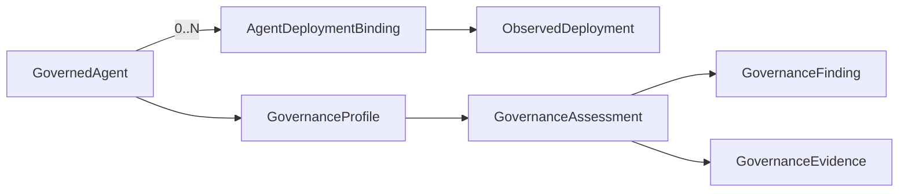
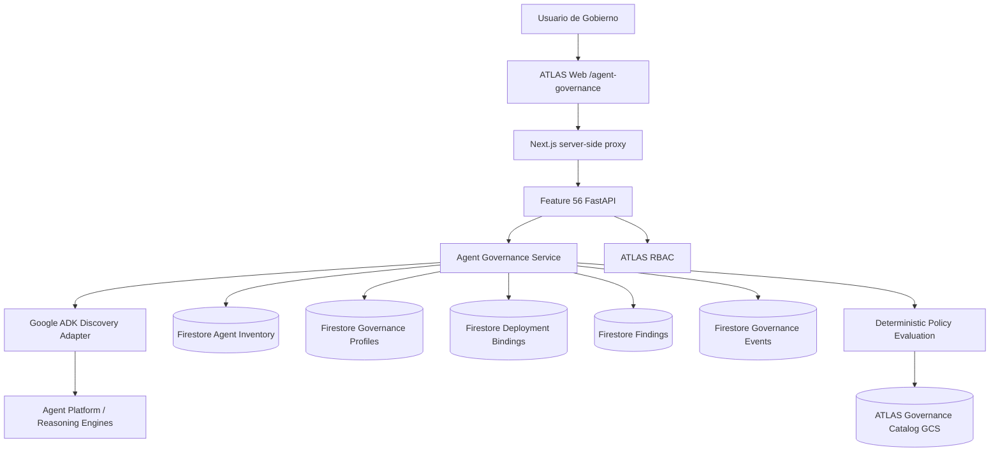

# Feature 56 — Gobierno de Agentes ADK

## 1. Estado del SPEC

- **Producto:** ATLAS DataGob
- **Feature:** 56
- **Nombre funcional:** Gobierno de Agentes
- **Nombre de producto:** ATLAS Agent Governance — ADK Edition
- **Estado:** Implementado para validación en preview aislado
- **Alcance V1:** Google ADK / Google Cloud
- **Tipo de cambio:** Nueva pantalla independiente dentro de ATLAS DataGob

## 2. Objetivo

Incorporar en ATLAS DataGob una nueva capacidad dedicada exclusivamente al **gobierno de agentes construidos/desplegados con Google ADK**, reutilizando la estructura visual y los patrones de observabilidad ya validados en el Governance Dashboard de Business Rules Silver, pero orientándolos a un inventario corporativo de agentes.

La capacidad debe permitir responder, desde una sola pantalla, preguntas como:

- ¿Cuántos deployments ADK existen en el entorno observado?
- ¿Cuántas identidades lógicas de agente están gobernadas?
- ¿Qué deployments aún no están asociados a una identidad gobernada?
- ¿Quién es responsable funcional y técnico de cada agente?
- ¿Cuál es su nivel de riesgo y autonomía?
- ¿Qué runtime/deployment utiliza?
- ¿Qué políticas y controles le aplican?
- ¿Qué hallazgos de gobierno están abiertos?
- ¿Qué evidencia existe sobre su evaluación?
- ¿Qué información operacional está disponible desde la plataforma sin instrumentar individualmente al agente?

## 3. Principio de producto

> **ATLAS gobierna el estate de agentes ADK desde un plano de control externo. No requiere integrar, modificar ni instrumentar de forma específica cada agente gobernado.**

La V1 será **out-of-band**.

ATLAS descubre información disponible en Google Agent Platform / Vertex AI y la complementa con metadatos de gobierno administrados por ATLAS.

### 3.1 Decisiones aprobadas

1. La nueva capacidad será una **pantalla adicional** de ATLAS DataGob.
2. La pantalla se denominará **Gobierno de Agentes**.
3. El alcance V1 será exclusivamente **Google ADK**.
4. El inventario técnico base se obtiene de los deployments `google-adk` expuestos por Google Agent Platform / Reasoning Engines.
5. Un Reasoning Engine representa un **deployment observado**, no una identidad lógica gobernada.
6. No se modificará el código de los agentes para poder gobernarlos.
7. No se instalará un SDK ATLAS dentro de cada agente.
8. ATLAS no interceptará llamadas, prompts, tool calls o respuestas en V1.
9. ATLAS no implementará enforcement runtime, kill switch ni bloqueo de tools en V1.
10. El estado de gobierno será una capa complementaria administrada por ATLAS.
11. La relación entre deployment observado e identidad gobernada será explícita y trazable; no se creará mediante heurísticas de nombres.
12. La pantalla reutilizará como referencia visual el patrón de dashboard ejecutivo, filtros, tablas y drill-down lateral ya probado en Business Rules Silver.

## 4. Posicionamiento dentro de ATLAS

```text
ATLAS DataGob
│
├── Portfolio Governance
│   ├── Intake conversacional
│   ├── Business Cases
│   ├── Comité
│   ├── Scoring
│   └── Backlog / Portafolio
│
└── Agent Governance
    ├── Resumen ejecutivo
    ├── Inventario ADK de deployments
    ├── Identidades gobernadas
    ├── Riesgo
    ├── Ownership
    ├── Autonomía
    ├── Políticas
    ├── Hallazgos
    └── Evidencia
```

Portfolio Governance y Agent Governance pertenecen al mismo producto, pero **no quedan acoplados funcionalmente en V1**. Un agente gobernado no necesita haber nacido de una demanda registrada en ATLAS.

## 5. Descubrimiento real validado

Spike ejecutado el 2026-08-22 contra:

```text
project  = proyectopersonal-480420
location = us-central1
```

Resultado:

```text
total_reasoning_engines = 24
total_google_adk        = 23
```

Los 23 deployments ADK observados pertenecían a dos familias funcionales principales, con múltiples candidatos/versiones. Este resultado congeló una decisión central: **no contar Reasoning Engines como agentes lógicos**.

Metadata comprobada en el entorno real:

- provider deployment id;
- resource name;
- display name;
- `spec.agentFramework = google-adk`;
- timestamps;
- service account;
- deployment source kind (`package` en el estate observado);
- project/location por scope de discovery.

Metadata que continúa siendo ATLAS-owned o `No evaluado` si no existe otra fuente canónica:

- Business Owner;
- Technical Owner;
- propósito de negocio;
- riesgo;
- autonomía;
- Human-in-the-Loop;
- clasificación de datos;
- herramientas autorizadas;
- modelo exacto cuando el provider no lo exponga de forma confiable;
- cumplimiento.

## 6. Modelo de dominio congelado



### 6.1 ObservedDeployment

Representa un recurso ADK observado en Google. Es read-only desde el punto de vista del gobierno.

```json
{
  "deployment_id": "google-adk:<provider-id>",
  "provider": "google_cloud",
  "framework": "google-adk",
  "provider_deployment_id": "...",
  "resource_name": "projects/.../locations/.../reasoningEngines/...",
  "display_name": "...",
  "project_id": "...",
  "location": "us-central1",
  "runtime_type": "vertex_ai_reasoning_engine",
  "deployment_target": "reasoning_engine",
  "model_name": null,
  "resource_status": null,
  "service_account": "...",
  "deployment_source_kind": "package",
  "created_at": "...",
  "updated_at": "...",
  "first_seen_at": "...",
  "last_seen_at": "...",
  "discovery_status": "discovered",
  "binding_status": "unbound",
  "governed_agent_id": null,
  "observed_metadata": {}
}
```

### 6.2 GovernedAgent

Representa la identidad lógica que ATLAS gobierna.

```json
{
  "agent_id": "AGT-...",
  "canonical_name": "...",
  "description": null,
  "governance_status": "not_assessed",
  "created_at": "...",
  "updated_at": "..."
}
```

### 6.3 AgentDeploymentBinding

Relación explícita entre la identidad lógica y una versión/deployment observado.

```json
{
  "binding_id": "ADB-...",
  "agent_id": "AGT-...",
  "deployment_id": "google-adk:...",
  "environment": null,
  "lifecycle_status": "active",
  "is_current": false,
  "binding_source": "human_confirmed",
  "bound_by": "...",
  "bound_at": "..."
}
```

### 6.4 GovernanceProfile

Campos mínimos:

- Business Owner;
- Technical Owner;
- propósito de negocio;
- área / dominio;
- ambiente declarado;
- criticidad del proceso;
- nivel de autonomía;
- nivel de riesgo;
- clasificación de datos;
- Human-in-the-Loop;
- escritura en sistemas;
- políticas aplicables;
- controles con evidencia;
- fecha de última evaluación;
- próximo review;
- observaciones.

## 7. Estados

### Discovery status

- `discovered`
- `active`
- `inactive`
- `not_observed`

### Binding status

- `unbound`
- `bound`
- `binding_review_required`

### Governance status

- `not_assessed`
- `under_review`
- `governed`
- `action_required`
- `decommissioned`

### Risk level

- `low`
- `medium`
- `high`
- `critical`
- `not_assessed`

Un deployment recién descubierto aparece como:

```text
Discovery: discovered
Binding: unbound
```

Una identidad recién creada aparece como:

```text
Governance: not_assessed
Risk: not_assessed
```

## 8. Evaluación de gobierno V1

La evaluación es determinística y se basa únicamente en metadata observada + datos explícitos del Governance Profile + catálogo versionado de ATLAS.

Checks mínimos implementados:

1. Ownership definido.
2. Propósito de negocio definido.
3. Riesgo evaluado.
4. Autonomía declarada.
5. Human oversight definido.
6. Clasificación de datos declarada.
7. Políticas aplicables identificadas.
8. Controles obligatorios con evidencia registrados.
9. Al menos un deployment observado vinculado.
10. Próximo review programado y vigente.

`governed` solo puede resultar de la evaluación determinística. Gemini podrá explicar hallazgos en una evolución posterior, pero no decide cumplimiento.

## 9. Políticas

La feature reutiliza el catálogo gobernado existente de ATLAS.

Para un agente ADK, las políticas se seleccionan determinísticamente por aplicabilidad `agentic_ai`, incluyendo, según el catálogo vigente:

- DATA-001;
- DATA-002;
- SEC-001;
- GENAI-001;
- AGENT-001;
- FINOPS-001.

Toda referencia persiste `id@version`. Ninguna política puede ser inventada por Gemini.

## 10. Persistencia

Colecciones dedicadas:

```text
atlas_agent_deployments
atlas_agents
atlas_agent_deployment_bindings
atlas_agent_governance
atlas_agent_governance_events
atlas_agent_findings
```

La feature no reutiliza `atlas_demands` para representar agentes.

Para el preview aislado se usan colecciones con sufijo `_f56_preview`.

## 11. Arquitectura implementada



Feature 56 extiende Feature 54, por lo que el Intake conversacional y las APIs anteriores permanecen disponibles.

## 12. APIs implementadas

```text
GET   /agent-governance/summary
GET   /agent-governance/deployments
POST  /agent-governance/discovery/refresh
GET   /agent-governance/agents
POST  /agent-governance/agents
GET   /agent-governance/agents/{agent_id}
PATCH /agent-governance/agents/{agent_id}/profile
POST  /agent-governance/agents/{agent_id}/deployments/bind
POST  /agent-governance/agents/{agent_id}/assess
GET   /agent-governance/findings
```

API version Feature 56: `0.9.0`.

## 13. RBAC

Read-only:

```text
agent_governance:read
```

Operación de gobierno:

```text
agent_governance:edit
agent_governance:bind
agent_governance:assess
agent_governance:refresh
```

Data Steward, Data Architect y Platform Admin reciben permisos de operación. Roles ejecutivos/read-only pueden consultar, pero no mutar gobierno.

## 14. UX implementada

Ruta:

```text
/agent-governance
```

Navegación:

```text
Gobierno de agentes
```

KPIs:

1. Deployments ADK.
2. Sin asociar.
3. Agentes gobernados.
4. Alto riesgo.
5. Hallazgos abiertos.
6. No evaluados.

Tabs:

```text
Agentes | Deployments
```

La vista de deployments permite abrir un drawer y elegir explícitamente:

```text
Asociar a agente existente
Crear identidad gobernada
```

El drawer del agente permite:

- revisar governance status;
- completar Business/Technical Owner;
- propósito;
- criticidad;
- riesgo;
- autonomía L0-L4;
- Human oversight;
- escritura en sistemas;
- clasificación de datos;
- controles con evidencia;
- próxima revisión;
- ejecutar assessment;
- revisar políticas, deployments y findings.

## 15. Requerimientos funcionales

- **FR56-01:** Enumerar deployments Google ADK del scope configurado sin modificarlos.
- **FR56-02:** Persistir snapshots observados de forma idempotente.
- **FR56-03:** No eliminar un deployment que deje de observarse; marcarlo `not_observed`.
- **FR56-04:** Mostrar deployments sin asociar de forma separada a agentes gobernados.
- **FR56-05:** Crear una identidad lógica gobernada por acción explícita.
- **FR56-06:** Vincular un deployment a una identidad gobernada mediante confirmación explícita.
- **FR56-07:** Mantener múltiples deployments por agente lógico.
- **FR56-08:** Mantener un Governance Profile independiente del provider.
- **FR56-09:** Evaluar gobierno mediante reglas determinísticas.
- **FR56-10:** Trazar políticas por ID y versión.
- **FR56-11:** Persistir findings y eventos de gobierno.
- **FR56-12:** Exponer resumen ejecutivo y drill-down.
- **FR56-13:** Aplicar RBAC de lectura/operación.
- **FR56-14:** Mantener Feature 54 y demás APIs existentes compatibles.

## 16. Requerimientos no funcionales

- **NFR56-01:** Discovery provider debe ser read-only.
- **NFR56-02:** Ningún agente debe requerir una librería ATLAS.
- **NFR56-03:** No se debe inferir compliance desde nombres o descripciones.
- **NFR56-04:** No se debe inferir identidad lógica por similitud de display name.
- **NFR56-05:** La UI debe mostrar `No disponible` / `No evaluado` cuando no exista evidencia.
- **NFR56-06:** Los refresh deben ser idempotentes.
- **NFR56-07:** La evidencia histórica no se elimina cuando cambia el provider estate.
- **NFR56-08:** Mutaciones de gobierno deben quedar auditadas con actor/timestamp.
- **NFR56-09:** Policy evaluation usa el catálogo versionado vigente.
- **NFR56-10:** El preview usa servicios y colecciones separados de producción.
- **NFR56-11:** CI debe mantener API tests, Web build/typecheck, container build y deploy-script validation en verde.

## 17. Criterios de aceptación

- **AC56-01:** El discovery real enumera los Reasoning Engines del proyecto/location configurado.
- **AC56-02:** Solo recursos `google-adk` entran al estate V1.
- **AC56-03:** El estate real observado devuelve 23 deployments ADK en el checkpoint 2026-08-22.
- **AC56-04:** La UI no presenta esos 23 deployments como 23 agentes lógicos.
- **AC56-05:** Antes del binding, cada deployment aparece `unbound`.
- **AC56-06:** La creación del GovernedAgent requiere acción explícita.
- **AC56-07:** Un deployment no puede quedar vinculado simultáneamente a dos identidades lógicas distintas.
- **AC56-08:** Un GovernedAgent puede mantener N deployments.
- **AC56-09:** La evaluación devuelve score, checks, policy refs y findings.
- **AC56-10:** El estado `governed` es determinístico.
- **AC56-11:** Los roles read-only no pueden editar/bind/assess/refresh.
- **AC56-12:** `/agent-governance` carga correctamente mediante el Web proxy.
- **AC56-13:** Feature 54 continúa disponible al arrancar `feature56_app`.
- **AC56-14:** Preview persiste únicamente en colecciones `_f56_preview`.
- **AC56-15:** Stable `atlas-datagob-api` y `atlas-datagob-web` no son modificados durante la validación preview.

## 18. Secuencia SDD

1. SPEC funcional — **PASS**.
2. Discovery spike real — **PASS**.
3. Contrato ObservedDeployment — **FROZEN**.
4. Separación GovernedAgent / Deployment — **FROZEN**.
5. Repository + Discovery Adapter — **IMPLEMENTED**.
6. API + RBAC — **IMPLEMENTED**.
7. Web `/agent-governance` — **IMPLEMENTED**.
8. CI — **VALIDAR EN HEAD FINAL**.
9. Preview aislado — **PENDIENTE EJECUCIÓN**.
10. E2E visual/funcional — **PENDIENTE**.
11. Merge — **NO AUTORIZADO AÚN**.
12. Production promotion — **FUERA DE ESTE CHECKPOINT**.

## 19. Preview

Script canónico:

```text
scripts/cloud_run/deploy_feature56_preview.sh
```

Servicios objetivo:

```text
atlas-datagob-api-f56-preview
atlas-datagob-web-f56-preview
```

El script construye imágenes inmutables desde el SHA actual, ejecuta discovery real, valida persistencia, despliega Web y verifica `/agent-governance` + proxy antes de declarar `FEATURE 56 PREVIEW: CONFORME`.

## 20. Diferido

- runtime enforcement;
- kill switch;
- interceptar tools/actions;
- captura obligatoria de prompts/responses;
- AgentOps completo de sesiones/runs para agentes no instrumentados;
- descubrimiento multi-project automático;
- Google ADK fuera de Agent Platform cuando no exista fuente canónica;
- LangGraph;
- Azure AI Foundry;
- Copilot Studio;
- Bedrock Agents;
- OpenAI Agents SDK;
- recomendación automática de bindings basada en similitud, salvo como sugerencia futura claramente no autoritativa.

## 21. North Star

> **Un líder de Gobierno debe poder abrir ATLAS y responder en segundos cuántos deployments ADK existen, cuáles pertenecen a qué agentes lógicos, quién responde por ellos, qué riesgo/autonomía tienen, qué controles les aplican y qué evidencia respalda su estado de gobierno, sin tener que modificar cada agente para obtener esa visibilidad.**
