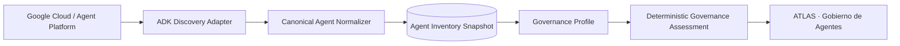
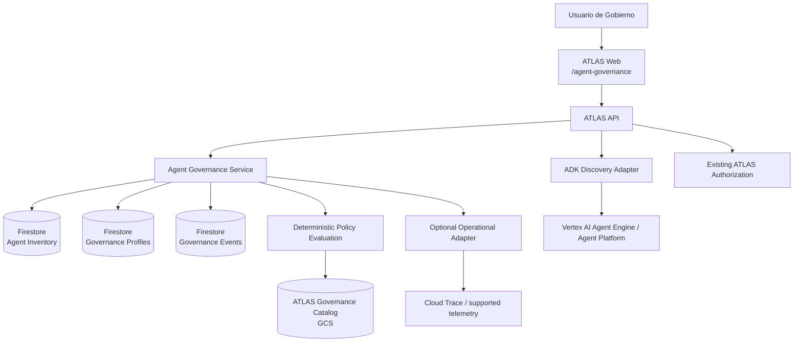
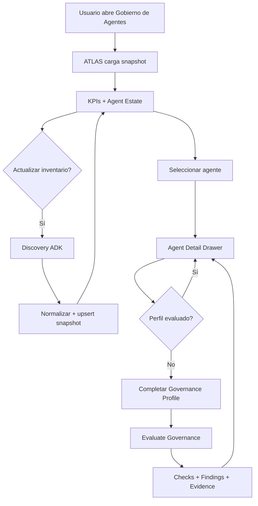

# Feature 56 — Gobierno de Agentes ADK

## 1. Estado del SPEC

- **Producto:** ATLAS DataGob
- **Feature:** 56
- **Nombre funcional:** Gobierno de Agentes
- **Nombre de producto:** ATLAS Agent Governance — ADK Edition
- **Estado:** Baseline funcional aprobado para SDD
- **Alcance V1:** Google ADK / Google Cloud
- **Tipo de cambio:** Nueva pantalla independiente dentro de ATLAS DataGob

## 2. Objetivo

Incorporar en ATLAS DataGob una nueva capacidad dedicada exclusivamente al **gobierno de agentes construidos/desplegados con Google ADK**, reutilizando la estructura visual y los patrones de observabilidad ya validados en el Governance Dashboard de Business Rules Silver, pero orientándolos a un inventario corporativo de agentes.

La capacidad debe permitir responder, desde una sola pantalla, preguntas como:

- ¿Cuántos agentes ADK existen en el entorno observado?
- ¿Cuántos están gobernados y cuántos todavía no han sido evaluados?
- ¿Quién es responsable funcional y técnico de cada agente?
- ¿Cuál es su nivel de riesgo y autonomía?
- ¿Qué modelo/runtime utiliza?
- ¿Qué políticas y controles le aplican?
- ¿Qué hallazgos de gobierno están abiertos?
- ¿Qué evidencia existe sobre su evaluación?
- ¿Qué información operacional está disponible desde la plataforma sin instrumentar individualmente al agente?

## 3. Principio de producto

> **ATLAS gobierna el estate de agentes ADK desde un plano de control externo. No requiere integrar, modificar ni instrumentar de forma específica cada agente gobernado.**

La V1 será **out-of-band**.

ATLAS podrá descubrir y observar información disponible en Google ADK / Agent Platform / Vertex AI y complementarla con metadatos de gobierno administrados por ATLAS.

### 3.1 Decisiones aprobadas

1. La nueva capacidad será una **pantalla adicional** de ATLAS DataGob.
2. La pantalla se denominará inicialmente **Gobierno de Agentes**.
3. El alcance V1 será exclusivamente **Google ADK**.
4. La pantalla utilizará como inventario base los agentes/deployments que puedan descubrirse mediante las capacidades disponibles de Google Agent Platform / Vertex AI / ADK.
5. No se modificará el código de los agentes para poder gobernarlos.
6. No se instalará un SDK ATLAS dentro de cada agente.
7. ATLAS no interceptará llamadas, prompts, tool calls o respuestas en V1.
8. ATLAS no implementará enforcement runtime, kill switch ni bloqueo de tools en V1.
9. El estado de gobierno será una capa complementaria administrada por ATLAS y enlazada al identificador estable del recurso descubierto.
10. La pantalla reutilizará como referencia visual el patrón de dashboard ejecutivo, filtros, tablas y drill-down lateral ya probado en Business Rules Silver.

## 4. Posicionamiento dentro de ATLAS

```text
ATLAS DataGob
│
├── Portfolio Governance
│   ├── Intake conversacional
│   ├── Business Cases
│   ├── Comité
│   ├── Scoring
│   └── Backlog / Portafolio
│
└── Agent Governance
    ├── Resumen ejecutivo
    ├── Inventario ADK
    ├── Riesgo
    ├── Ownership
    ├── Autonomía
    ├── Políticas
    ├── Hallazgos
    ├── Salud / actividad disponible
    └── Evidencia
```

Portfolio Governance y Agent Governance pertenecen al mismo producto, pero **no quedan acoplados funcionalmente en V1**. Un agente gobernado no necesita haber nacido de una demanda registrada en ATLAS.

## 5. Alcance funcional V1

### 5.1 Resumen ejecutivo

La pantalla debe mostrar como mínimo:

- total de agentes ADK descubiertos;
- agentes gobernados;
- agentes no evaluados;
- agentes de alto riesgo;
- hallazgos abiertos;
- agentes con revisión requerida;
- estado operacional agregado cuando la fuente lo permita.

Los KPIs deberán ser clicables y actuar como filtros o abrir el detalle correspondiente.

### 5.2 Inventario ADK

ATLAS debe mantener un inventario normalizado de agentes/deployments observados.

Campos observados, cuando estén disponibles desde la plataforma:

- `provider_agent_id`;
- `resource_name`;
- `display_name`;
- `framework`;
- `runtime_type`;
- `project_id`;
- `location`;
- `deployment_target`;
- `model_name`;
- `resource_status`;
- `created_at`;
- `updated_at`;
- metadata/tags disponibles;
- source de discovery;
- timestamp de última observación.

ATLAS **no debe inventar** campos que Google no exponga. Los campos no disponibles se muestran como `No disponible` o `No evaluado`.

### 5.3 Perfil de gobierno

ATLAS complementará el recurso observado con un perfil administrado de gobierno.

Campos mínimos:

- Business Owner;
- Technical Owner;
- propósito de negocio;
- área / dominio;
- ambiente declarado;
- criticidad del proceso;
- nivel de autonomía;
- nivel de riesgo;
- clasificación de datos;
- Human-in-the-Loop requerido;
- acceso de escritura a sistemas, si aplica;
- políticas aplicables;
- controles requeridos;
- estado de evaluación;
- fecha de última evaluación;
- próximo review;
- observaciones.

### 5.4 Estado de gobierno

Se separan tres conceptos para evitar mezclar lifecycle, riesgo y compliance.

#### Discovery status

- `discovered`
- `active`
- `inactive`
- `not_observed`

#### Governance status

- `not_assessed`
- `under_review`
- `governed`
- `action_required`
- `decommissioned`

#### Risk level

- `low`
- `medium`
- `high`
- `critical`
- `not_assessed`

Un agente nuevo descubierto debe aparecer por defecto como:

```text
Discovery: discovered
Governance: not_assessed
Risk: not_assessed
```

### 5.5 Evaluación de gobierno

La evaluación de V1 será determinística y basada únicamente en metadatos observados + datos explícitamente mantenidos en el perfil de gobierno.

Dimensiones mínimas:

1. Ownership definido.
2. Propósito de negocio definido.
3. Riesgo evaluado.
4. Autonomía declarada.
5. Human oversight definido.
6. Datos / clasificación declarados.
7. Políticas aplicables identificadas.
8. Controles obligatorios registrados.
9. Evidencia mínima disponible.
10. Review vigente.

La evaluación no deberá usar al LLM como fuente de verdad para decidir cumplimiento.

Gemini puede posteriormente explicar hallazgos, pero la condición `governed` debe derivarse de reglas determinísticas.

### 5.6 Políticas

La feature debe reutilizar el catálogo de políticas gobernadas de ATLAS.

Cuando corresponda, se incluirá `AGENT-001` y cualquier política adicional de agentes que se agregue formalmente al catálogo versionado.

Reglas:

- ninguna política puede ser inventada por Gemini;
- toda política mostrada debe incluir `id` y `version`;
- los hallazgos deben referenciar la política/control que los origina;
- cambios de versión de política deben ser trazables.

### 5.7 Hallazgos

Modelo mínimo de finding:

```json
{
  "finding_id": "AGF-...",
  "agent_id": "...",
  "policy_id": "AGENT-001",
  "policy_version": "1.0",
  "severity": "medium",
  "status": "open",
  "title": "Human oversight no definido",
  "description": "...",
  "detected_at": "...",
  "resolved_at": null,
  "evidence_refs": []
}
```

Estados:

- `open`
- `accepted`
- `remediated`
- `closed`

### 5.8 Evidencia

Cada agente deberá poder exponer desde el drawer una sección de evidencia con:

- snapshot observado del recurso;
- perfil de gobierno vigente;
- resultado de evaluación;
- políticas/versiones evaluadas;
- hallazgos;
- historial de cambios de governance profile;
- actor que realizó el cambio;
- timestamps.

V1 no requiere almacenar prompts/respuestas de los agentes como evidencia obligatoria.

## 6. Discovery de agentes ADK

### 6.1 Principio

ADK es el framework, no debe asumirse que todos los agentes ADK están desplegados de la misma forma. El diseño utilizará un **ADK Discovery Adapter** para desacoplar ATLAS del mecanismo de despliegue.



### 6.2 Providers iniciales

La implementación deberá soportar mediante adapters las fuentes oficiales disponibles en el entorno, priorizando:

1. **Vertex AI Agent Engine / Reasoning Engine resources** para deployments administrados.
2. Metadata de deployment disponible mediante Agent Platform / agents-cli para despliegues ADK administrados por esa toolchain.
3. Fuentes adicionales de Google Cloud solo cuando exista una relación inequívoca con un deployment ADK.

No se deberá inferir que un Cloud Run cualquiera es un agente ADK únicamente por nombre.

### 6.3 Compatibilidad de API

El adapter ocultará diferencias de nomenclatura entre recursos/versiones de Google (`AgentEngine` / `ReasoningEngine`). El dominio de ATLAS no dependerá de esos nombres.

Interfaz conceptual:

```python
class AgentDiscoveryProvider:
    def list_agents(self) -> list[ObservedAgent]: ...
    def get_agent(self, provider_agent_id: str) -> ObservedAgent: ...
```

### 6.4 Refresh

- La UI leerá principalmente del snapshot normalizado de ATLAS.
- `Actualizar inventario` ejecutará un refresh contra el provider.
- Nuevos recursos se insertan como `not_assessed`.
- Recursos no observados en un refresh no se borran físicamente; se marcan para revisión (`not_observed`) conservando historial.
- El refresh debe ser idempotente.

## 7. Arquitectura propuesta



### 7.1 Persistencia sugerida

Colecciones separadas del portafolio de demandas:

```text
atlas_agent_inventory
atlas_agent_governance
atlas_agent_governance_events
atlas_agent_findings
```

La feature no debe reutilizar `atlas_demands` para representar agentes.

## 8. Modelo canónico

### 8.1 ObservedAgent

```json
{
  "agent_id": "atlas-provider-normalized-id",
  "provider": "google_cloud",
  "framework": "adk",
  "provider_agent_id": "...",
  "resource_name": "projects/.../locations/.../...",
  "display_name": "...",
  "project_id": "...",
  "location": "us-central1",
  "runtime_type": "agent_engine",
  "deployment_target": "agent_runtime",
  "model_name": null,
  "resource_status": "active",
  "observed_metadata": {},
  "source": "vertex_ai_agent_engine",
  "first_seen_at": "...",
  "last_seen_at": "..."
}
```

### 8.2 GovernanceProfile

```json
{
  "agent_id": "...",
  "business_owner": null,
  "technical_owner": null,
  "business_purpose": null,
  "business_area": null,
  "environment": null,
  "business_criticality": "not_assessed",
  "autonomy_level": "not_assessed",
  "risk_level": "not_assessed",
  "data_classification": [],
  "human_oversight": "not_assessed",
  "writes_to_systems": null,
  "applicable_policies": [],
  "required_controls": [],
  "governance_status": "not_assessed",
  "last_assessed_at": null,
  "next_review_at": null,
  "notes": null
}
```

### 8.3 GovernanceAssessment

```json
{
  "agent_id": "...",
  "assessment_id": "AGA-...",
  "status": "action_required",
  "score": 70,
  "checks": [],
  "policy_refs": [],
  "finding_ids": [],
  "evaluated_at": "...",
  "evaluator": "deterministic"
}
```

## 9. UX / Nueva pantalla

### 9.1 Ruta

```text
/agent-governance
```

Debe incorporarse a `ProductNavigation` como una opción independiente:

```text
Portafolio | Intake | Gobierno de Agentes
```

El nombre final visible podrá abreviarse a `Agentes` si la navegación lo requiere, pero el encabezado de la pantalla será **Gobierno de Agentes**.

### 9.2 Encabezado

```text
ATLAS · GOBIERNO DE AGENTES
Gobierno del ecosistema de agentes Google ADK
```

Acciones:

- Periodo, solo si existen métricas operacionales temporales.
- `Actualizar inventario`.
- timestamp `Última sincronización`.

### 9.3 KPIs V1

Prioridad visual:

1. Agentes ADK.
2. Gobernados.
3. No evaluados.
4. Alto riesgo.
5. Hallazgos abiertos.
6. Revisión requerida.

Si existen métricas operacionales confiables y desacopladas del agente se podrán incorporar como segunda fila:

- runs;
- success rate;
- p90;
- alertas.

La UI no mostrará un KPI operacional si la fuente no existe.

### 9.4 Secciones

#### A. Estado de gobierno

- distribución Governed / Under Review / Action Required / Not Assessed;
- distribución de riesgo;
- tendencia de agentes descubiertos/gobernados, si existe histórico.

#### B. Agent Estate

Tabla principal:

| Agente | Runtime | Estado | Owner | Riesgo | Autonomía | Gobierno | Findings | Última observación |
|---|---|---|---|---|---|---|---|---|

Debe soportar filtros por:

- governance status;
- risk level;
- owner;
- environment;
- runtime;
- location;
- policy finding.

#### C. Hallazgos

Lista priorizada por severidad y antigüedad.

#### D. Plataforma / discovery health

Mostrar estado del adapter y última sincronización. No confundir disponibilidad del discovery con salud funcional del agente.

### 9.5 Agent Detail Drawer

Reutilizar el patrón de drawer lateral probado en el dashboard de Business Rules.

Estructura:

```text
<Agent Display Name>
────────────────────────────────────

ADK / PLATFORM
Resource
Project / Region
Runtime
Model (si está disponible)
Estado observado
Last seen

GOVERNANCE
Business Owner
Technical Owner
Purpose
Risk
Autonomy
Human Oversight
Governance Status
Next Review

POLICIES
✓ policy / control compliant
⚠ finding
— not evaluated

OPERATIONAL
Solo métricas disponibles y confiables

EVIDENCE
Snapshot
Assessment
Findings
Change history
```

Acciones V1:

- `Editar perfil de gobierno`;
- `Evaluar gobierno`;
- `Ver evidencia`;
- `Ver hallazgos`.

No incluir `Pause Agent`, `Disable Writes` ni controles runtime en V1.

## 10. API propuesta

### Read

```text
GET /agent-governance/summary
GET /agent-governance/agents
GET /agent-governance/agents/{agent_id}
GET /agent-governance/findings
GET /agent-governance/agents/{agent_id}/evidence
```

### Discovery

```text
POST /agent-governance/discovery/refresh
GET  /agent-governance/discovery/status
```

### Governance

```text
PATCH /agent-governance/agents/{agent_id}/profile
POST  /agent-governance/agents/{agent_id}/assess
PATCH /agent-governance/findings/{finding_id}
```

## 11. RBAC

Permisos nuevos sugeridos:

```text
agent_governance:read
agent_governance:refresh
agent_governance:update
agent_governance:assess
agent_governance:manage_findings
```

Compatibilidad MVP con roles actuales:

- `data_steward`: read + refresh + update + assess + manage_findings;
- `committee_member`: read;
- `executive`: read.

La autorización deberá permanecer en el servicio determinístico de ATLAS y no en Gemini.

## 12. Requerimientos funcionales

- **FR56-01**: Mostrar una nueva pantalla independiente `Gobierno de Agentes`.
- **FR56-02**: Descubrir agentes/deployments ADK mediante un provider desacoplado.
- **FR56-03**: Normalizar los recursos observados a un modelo canónico.
- **FR56-04**: Persistir snapshots sin borrar historial de recursos no observados.
- **FR56-05**: Mostrar KPIs ejecutivos derivados del inventario y gobierno.
- **FR56-06**: Mostrar tabla filtrable del Agent Estate.
- **FR56-07**: Abrir un Agent Detail Drawer al seleccionar un agente.
- **FR56-08**: Permitir completar/editar el Governance Profile sin modificar el agente.
- **FR56-09**: Ejecutar una evaluación determinística de gobierno.
- **FR56-10**: Crear y administrar findings trazables a políticas/versiones.
- **FR56-11**: Mantener evidencia e historial de cambios de gobierno.
- **FR56-12**: Permitir refresh manual idempotente del inventario.
- **FR56-13**: Identificar automáticamente nuevos agentes como `not_assessed`.
- **FR56-14**: Marcar recursos previamente conocidos y no observados sin eliminarlos.
- **FR56-15**: Mostrar métricas operacionales únicamente cuando una fuente confiable esté disponible sin integración específica del agente.
- **FR56-16**: Reutilizar el catálogo de políticas versionado existente de ATLAS.
- **FR56-17**: Mantener Agent Governance desacoplado de Portfolio Governance en V1.

## 13. Requerimientos no funcionales

- **NFR56-01**: No requerir cambios de código en los agentes gobernados.
- **NFR56-02**: No requerir SDK ATLAS dentro de agentes.
- **NFR56-03**: No interceptar ejecución, prompt, respuesta o tool calls en V1.
- **NFR56-04**: Discovery idempotente.
- **NFR56-05**: Ningún dato no observado debe ser inventado por LLM o UI.
- **NFR56-06**: Evaluación de cumplimiento determinística y auditable.
- **NFR56-07**: Cada política usada debe estar versionada y trazable.
- **NFR56-08**: Toda mutación de governance profile/finding genera evento de auditoría.
- **NFR56-09**: La UI debe continuar operando con el último snapshot si la API de discovery está temporalmente indisponible, señalando el estado `stale`.
- **NFR56-10**: El refresh no debe bloquear el render del dashboard.
- **NFR56-11**: El dominio de ATLAS no dependerá del nombre concreto `ReasoningEngine` o `AgentEngine`.
- **NFR56-12**: Soportar inicialmente al menos 250 agentes sin degradar la navegación del dashboard.
- **NFR56-13**: Lectura del dashboard desde snapshot p95 <= 2.5 s para 250 agentes en condiciones nominales.
- **NFR56-14**: Refresh de inventario <= 60 s para 250 agentes en condiciones nominales del provider.
- **NFR56-15**: Seguir los patrones existentes de Cloud Run, Firestore, GCS Governance y autorización de ATLAS.

## 14. Criterios de aceptación

- **AC56-01**: Existe una nueva ruta `/agent-governance` accesible desde navegación de ATLAS.
- **AC56-02**: La pantalla lista recursos ADK obtenidos mediante el Discovery Adapter, no una lista hardcodeada.
- **AC56-03**: Un agente nuevo aparece automáticamente como `not_assessed` después de refresh.
- **AC56-04**: Un recurso no observado no se borra; mantiene historial y queda marcado.
- **AC56-05**: Los KPIs de inventario coinciden con la persistencia canónica.
- **AC56-06**: Los filtros de Agent Estate funcionan sin recargar la página completa.
- **AC56-07**: El drawer muestra solo información observada o registrada explícitamente.
- **AC56-08**: Se puede completar ownership, risk, autonomy, data classification y oversight sin modificar el agente ADK.
- **AC56-09**: `Evaluate Governance` produce checks determinísticos y findings trazables.
- **AC56-10**: Un agente solo llega a `governed` cuando todos los controles obligatorios definidos para V1 están satisfechos.
- **AC56-11**: Cada finding incluye policy id/version o una regla canónica de governance explícita.
- **AC56-12**: Cada actualización de governance profile queda registrada con actor y timestamp.
- **AC56-13**: Una falla de discovery no elimina el dashboard; muestra último snapshot + alerta de freshness.
- **AC56-14**: Ningún agente necesita incorporar código, callback o SDK ATLAS para aparecer y ser gobernado.
- **AC56-15**: No existe enforcement runtime en la feature V1.
- **AC56-16**: Portfolio Governance existente mantiene su comportamiento y contratos sin regresión.
- **AC56-17**: Intake conversacional, backlog, comité y synthetic data mantienen pruebas existentes en verde.

## 15. Referencia visual reutilizable

La V1 tomará como referencia de experiencia el **Governance Dashboard Preview V1 de Business Rules Silver**:

- layout ejecutivo con sidebar;
- KPI cards clicables;
- filtros visibles/removibles;
- tabla de historial/estate;
- status/risk visualizations;
- drawer lateral de detalle;
- health/alerts separados de la vista principal;
- navegación por secciones;
- deep links cuando agreguen valor.

La semántica cambia de `Gobierno DataOps — Business Rules Silver` a `ATLAS · Gobierno de Agentes`.

No se copiará dependencia alguna del backend de Business Rules Silver.

## 16. Flujo UX principal



## 17. Secuencia SDD recomendada

### Fase 1 — Discovery contract

1. Spike técnico contra el inventario ADK/Agent Platform real del proyecto.
2. Confirmar campos efectivamente disponibles.
3. Implementar `AgentDiscoveryProvider`.
4. Generar fixture canónico para tests.

### Fase 2 — Domain + persistence

1. `ObservedAgent`.
2. `GovernanceProfile`.
3. `GovernanceAssessment`.
4. `PolicyFinding`.
5. audit events.

### Fase 3 — API

Implementar summary, agents, detail, discovery refresh, profile, assessment y findings.

### Fase 4 — UI preview

Construir la pantalla independiente utilizando el patrón visual validado en Business Rules Silver.

### Fase 5 — Governance evaluation

Conectar políticas GCS + reglas determinísticas + evidencia.

### Fase 6 — E2E

Validar con los agentes ADK reales visibles en el ambiente, sin mocks como evidencia final.

### Fase 7 — Production promotion

Promoción independiente, revisión exacta de SHA, Cloud Run revision, smoke, evidencia y rollback.

## 18. Fuera de alcance V1

- LangGraph, CrewAI, Azure AI Foundry, Bedrock Agents, OpenAI Agents SDK.
- Modificar agentes existentes.
- Instrumentación custom obligatoria en cada agente.
- Interceptar tool calls.
- Enforcement runtime.
- Kill switch.
- Deshabilitar escritura automáticamente.
- Inyección/modificación de prompts.
- Evaluación automática del contenido de conversaciones.
- LLM-as-judge como fuente de compliance.
- Correlación obligatoria entre agente y demanda del Portfolio.
- Cost allocation avanzado por agente si la fuente nativa no lo permite.
- Gobierno cross-cloud.

## 19. Evolución futura

La arquitectura deberá permitir agregar providers sin cambiar el modelo canónico:

```text
Agent Discovery Provider
│
├── Google ADK / Agent Platform      ← V1
├── LangGraph                        ← futuro
├── Azure AI Foundry                 ← futuro
├── Amazon Bedrock                   ← futuro
└── OpenAI Agents                    ← futuro
```

Evoluciones posteriores posibles:

- runtime policy enforcement;
- tool-level authorization;
- approval gates;
- agent kill/pause controls;
- cost governance;
- evals automáticos;
- prompt/model change governance;
- A2A topology/governance;
- multi-agent system graph;
- correlation entre Agent Governance y Portfolio Governance.

## 20. North Star

> **Cualquier líder de Gobierno debe poder abrir ATLAS y responder en segundos: cuántos agentes ADK existen, quién responde por ellos, qué riesgo tienen, qué controles aplican, cuáles están realmente gobernados y qué evidencia respalda esa conclusión.**
